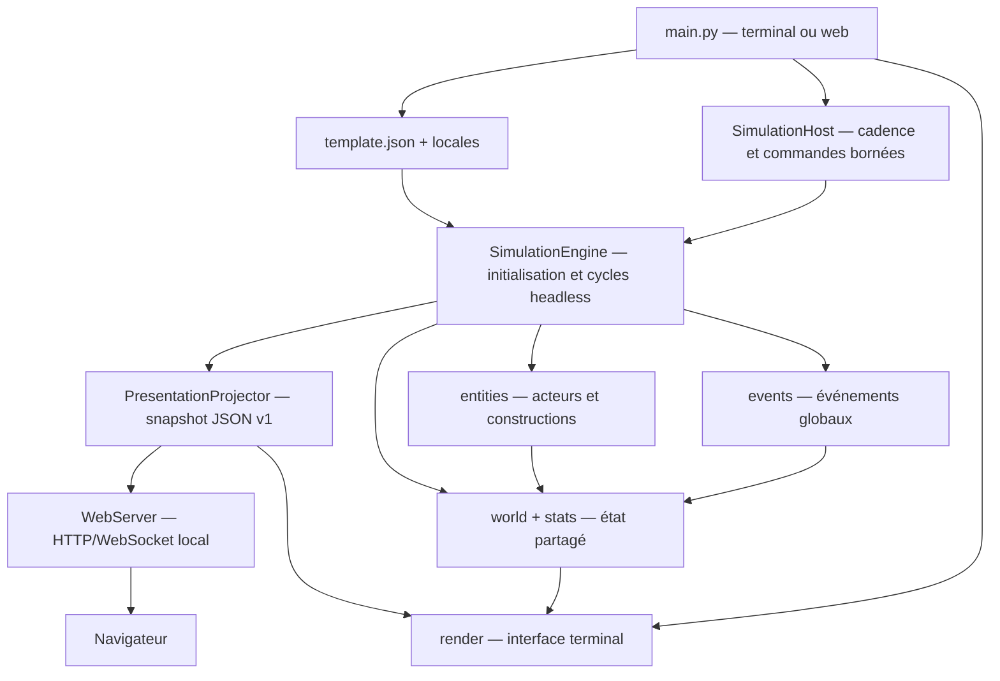

# Référentiel technique de Chartographist

Ce document est la carte de travail du dépôt. Il sert à retrouver rapidement le point d'entrée, le propriétaire d'une responsabilité, les données partagées et les fichiers à modifier ensemble.

Les règles impératives de contribution sont définies dans [`AGENTS.md`](AGENTS.md) : prévention des régressions, i18n systématique et TDD strict test-first pour chaque modification fonctionnelle.

La stratégie d'évolution centrée sur l'émergence et les plans d'implémentation des phases 8 à 15 sont détaillés dans [ROADMAP_EMERGENCE.md](ROADMAP_EMERGENCE.md).

> État analysé : branche `evolution`, le 26 août 2026. Le projet propose les adaptateurs terminal et serveur web local sur un même moteur. Une suite de 437 tests `unittest` de non-régression est disponible sous [`tests/`](tests/).

## Vue d'ensemble

Le programme construit un monde déterministe à partir d'une graine et de [`template.json`](template.json), puis exécute une boucle mensuelle qui met à jour la géographie, les entités, l'économie, les événements et l'affichage terminal.



Ordre d'initialisation à préserver :

1. `main.py` lit les arguments, la locale et le template ;
2. `SimulationEngine.create()` initialise [`RandomService`](core/random_service.py) ;
3. le moteur génère religions, espèces humanoïdes et espèces animales ;
4. le moteur assemble géographie et services du monde ;
5. le moteur crée la grille spatiale et les villes initiales ;
6. `main.py` crée le moteur de rendu, puis appelle `SimulationEngine.step()` à chaque frame.

## Contrats structurants

### État global `world`

Créé par [`core/world_factory.py`](core/world_factory.py), complété et possédé par [`core/simulation_engine.py`](core/simulation_engine.py), puis transmis à presque tous les systèmes :

| Clé | Type / rôle | Propriétaire principal |
|---|---|---|
| `width`, `height` | dimensions de la carte | `world_factory.py` |
| `seed`, `cycle` | reproductibilité et horloge mensuelle | `world_factory.py`, `simulation_engine.py` |
| `elev`, `riv`, `plates` | relief NumPy, rivières et plaques | `core/geo.py` |
| `road` | grille mutable des routes | `world_factory.py`, `history/history_engine.py` |
| `entities` | instance de `EntityManager` | `core/entities.py` |
| `influence` | cartes de peur et d'odeur | `core/influence.py` |
| `grid` | index spatial reconstruit à chaque cycle | `core/grid_service.py`, ajouté par `SimulationEngine.create()` |
| `chronicles` | graphe durable v2 : ID/date/type/message, acteurs, objets, lieux, faits, causes, conséquences et liens causaux bornés | `core/chronicles.py`, alimenté par `SimulationEngine` |
| `next_chronicle_id` | prochain identifiant monotone de chronique | `core/chronicles.py` |
| `sites` | registre versionné et borné des lieux remarquables : identité, position, propriétaires, occupants, ressources, apparence, découvertes et historique | `core/sites.py` |
| `artifacts` | registre versionné et borné des objets uniques : identité, qualité, créateur, matériaux, inscription, détenteur, lieu, renommée et provenance | `core/artifacts.py` |
| `legends` | registre borné des faits promus, versions publiques culturelles/partisanes, propagation, renommée et motivations | `core/legends.py` |
| `diplomacy` | dictionnaire de relations symétriques indexées par paire canonique d’`entity_id` | `core/diplomacy.py` |
| `next_relation_id` | prochain identifiant monotone de relation | `core/diplomacy.py` |
| `climate` | saison, anomalies thermiques/pluviométriques, sécheresse, crue et dernier cycle traité | `core/climate.py` |
| `resources` | grilles renouvelables, perturbations persistantes et cadence de régénération | `core/resources.py` |
| `notables` | registre des personnages actifs devenus historiquement importants, indexé par `entity_id` stable | `core/characters.py` |
| `notable_archive` | instantanés défensifs des notables disparus, incluant leur état personnel et leurs mémoires | `core/characters.py` |
| `scenario` | identifiant, statut, objectifs/progression, cycle de fin et marqueur d’initialisation | `core/scenarios.py` |
| `metrics` | état observable courant, flux cumulés et rapport d’amorçage, intégralement sérialisables | `core/simulation_metrics.py` |
| `politics` | factions stables, propositions, institutions, politiques temporaires, conflits bornés et pression migratoire | `core/factions.py`, `core/institutions.py`, `core/politics.py` |
| `territory` | revendications par tuile, propriétaires, frontières, conflits, ressources stratégiques et transferts de traité | `core/territory.py` |
| `pathfinding` | cache borné, empreinte du monde, révision, compteurs de requêtes et coûts du dernier chemin | `core/pathfinding.py` |
| `migration` | cohortes bornées, diasporas, intégration, retours et compteurs de migrants | `core/migration.py` |
| `warfare` | campagnes, armées, ravitaillement, engagements, occupations, prisonniers et coûts | `core/warfare.py` |
| `peace` | traités, dettes, vétérans, réfugiés, ruines et conséquences d’après-guerre | `core/peace.py` |

L'objet `stats` construit par `world_factory` contient initialement `year`, `seed` et `logs`. `SimulationEngine.step()` ajoute `month` dès le premier cycle, avant le premier rendu normal ; le reveal initial n'utilise que `seed`. Toute nouvelle clé consommée par le rendu doit être initialisée avant la frame qui l'utilise.

### Cadences de simulation

[`SimulationEngine.step()`](core/simulation_engine.py) applique trois fréquences :

- chaque cycle : climat et anomalies, régénération spatiale lorsqu’elle atteint sa cadence, diplomatie globale, grille, apparition de faune, `process_turn()`, besoins personnels mensuels, événements, scénario, politique, guerre, migrations et territoire selon leurs cadences opt-in, synchronisation des logs, archivage des notables inactifs et nettoyage ; dans chaque ville ou village, la production matérielle optionnelle est avancée une fois après la mise à jour des citoyens ; `main.py` effectue ensuite le rendu ;
- selon `characters.decision_interval` (3 dans le template) : une fraction déterministe des personnages recalcule son choix, décalée par `entity_id` afin d’éviter un pic global ;
- tous les 12 cycles : usure des guerres, création des trêves arrivées à maturité, aide alimentaire alliée et synchronisation de l’adaptateur historique `City.enemies` ;
- tous les 10 cycles : décroissance des influences, projection d'influence et signes vitaux ;
- tous les 100 cycles : reproduction et logique de long terme.

### Déterminisme

Toute décision aléatoire de simulation doit passer par [`core/random_service.py`](core/random_service.py). L'usage direct de `random` est réservé à la création d'une graine quand l'utilisateur n'en fournit pas. [`core/system.py`](core/system.py) conserve les graines numériques telles quelles et transforme les graines textuelles par les huit premiers octets de SHA-256 : leur valeur est donc stable entre processus et indépendante de `PYTHONHASHSEED`.

### Entités actives

La hiérarchie réellement utilisée est :

```text
Entity
├── Human
│   ├── Farmer
│   ├── Fisherman
│   ├── Hunter
│   ├── Settler
│   ├── Soldier
│   └── Trader
├── Animal (toutes les espèces sont des données de template.json)
├── Construct
│   ├── City
│   ├── Village
│   └── Ruins
└── UFO
```


### Compte économique des établissements

Lorsque `config['materials']['enabled']` vaut `true`, les colonies acquièrent paresseusement un `stockpile` versionné et une file `production` versionnée. Les prix multi-biens dépendent du stock cible ; les routes candidates sont triées de façon déterministe par prix, distance, risque et identifiant stable. Les transferts respectent réserve du vendeur, capacité du stockage, capacité du marchand et solvabilité, en conservant exactement biens et monnaie.

Chaque `City` et `Village` possède un dictionnaire `economy`, initialisé ou migré paresseusement par [`core/economy.py`](core/economy.py). Il contient trésorerie, nourriture et biens importés/exportés, richesse dépensée/gagnée, nombre de transactions et derniers prix. `food_stock` et `max_food` restent les sources de vérité historiques lorsque le mode matériel est absent ou désactivé.

Lorsque `config['economy']['enabled']` vaut `true`, un marchand transfère réellement un surplus alimentaire de l'origine vers la destination et la destination paie au prix calculé selon sa pénurie. Nourriture et richesse sont conservées pendant la transaction. Sans section économique ou avec `enabled: false`, le bonus alimentaire historique du marchand est conservé.

### Observabilité et équilibre alimentaire

`core/simulation_metrics.py` possède `world['metrics']` et expose les états agrégés ainsi que les flux alimentaires, démographiques, économiques, matériels, écologiques et politiques. Les flux politiques cumulent propositions, décisions, successions, crises, protestations, sabotages, coups, révoltes, réformes, exodes, réponses et taxes. `SimulationEngine.get_metrics_snapshot()` renvoie une copie défensive ; `run_observed()` échantillonne sans tirage aléatoire supplémentaire.

### Audit performance et visibilité — consolidation du 24 août 2026

Le profil de référence active ressources, personnages, matériaux et connaissances sur une carte 24 × 12. Sur 200 cycles instrumentés, le temps passe de 31,925 s à 5,883 s (−81,6 %) et les appels de 198,6 M à 30,4 M, avec une mémoire maximale stable autour de 39 Mo. La cause principale était la reconstruction et la copie profonde du catalogue matériel à chaque ration individuelle. `core.materials.runtime_catalog()` conserve désormais au plus seize catalogues validés par configuration runtime immuable. Le schéma de métriques v2 ne fusionne ses valeurs par défaut qu’à la création ou à la migration.

Le nettoyage statique a supprimé l’ancienne classe `Actor`, la formule de biome dupliquée dans le rendu et la dérive culturelle privée jamais appelée. Les API publiques à faible référence, les méthodes de protocole, les décorateurs d’événements et les points d’extension restent conservés pour la compatibilité.

| Système influent | Effet réel sur la simulation | Surface avant l’audit | Surface consolidée |
|---|---|---|---|
| Climat | saisons, biomes, récoltes, habitats et anomalies | en-tête, chroniques et API tuile | onglet `[Y]` avec saison, risques et anomalies |
| Ressources | régénération, extraction, feu et capacités locales | API headless et métriques | ratios mondiaux et flux dans `[Y]` |
| Écologie | plafond de faune par monde, espèce et biome | métriques seulement | population, apparitions, naissances et morts dans `[Y]` |
| Alimentation | production, consommation, pertes, famine et spécialisation | stock des cités et métriques | stocks et flux cumulés dans `[Y]` |
| Économie | prix, trésorerie, commerce et expansion | cités, chroniques et API | agrégat mondial dans `[Y]` |
| Diplomatie | confiance, pactes, alliances, guerres et trêves | onglet `[D]`, chroniques et API | résumé des statuts dans `[Y]` |
| Personnages | besoins, décisions, mémoire, notabilité et repos | inspection par entité | notables et décisions cumulées dans `[Y]` |
| Matériaux | stocks, ordres, métiers, marchés et infrastructures | inspection et métriques headless | charge, biens, ordres et niveaux bâtis dans `[Y]` |
| Connaissances | faits locaux, exploration, rumeurs et choix imparfaits | inspection par entité | détenteurs, faits, tuiles et décisions dans `[Y]` |
| Influence | traces olfactives, attraction et peur spatiale | effet indirect sur la carte | cellules actives et pics dans `[Y]` |
| Événements | volcans, épidémies et enlèvements | journaux et chroniques lors d’un déclenchement | catalogue et déclenchements cumulés dans `[Y]` |
| Scénario | état initial, victoire, défaite et objectifs | en-tête | statut et progression dans `[Y]` |

`core.system_visibility.systems_snapshot()` et `SimulationEngine.get_systems_snapshot()` inventorient vingt et un systèmes, dont territoire, chemins, migrations, guerre, paix, histoire causale, sites et artefacts persistants, de façon déterministe, sérialisable et défensive, sans tirage aléatoire. Le rendu terminal expose la même lecture via `[B]` puis `[Y]`, en français, anglais et espagnol.

`tools/observatory.py` exécute plusieurs graines, calcule médianes, dispersions, extinction, activation des systèmes et saturation, puis sépare le rapport JSON de l’export CSV. Profils de référence : 120 cycles, 1 200 cycles et reprise à 600/1 200.

`config['food_balance']` active rendement générique configurable, pertes de stockage et spécialisation fondée sur une fenêtre de ratios. Sans cette section ou avec le mode désactivé, le rendement et les seuils historiques sont conservés. `config['ecology']['population_limits']` partage un même budget entre apparitions et naissances, avec capacités mondiale, par espèce et par biome.

### Relations diplomatiques

`core/diplomacy.py` conserve dans `world['diplomacy']` une relation unique et symétrique par paire canonique d’identifiants stables (`min_id:max_id`). Une relation contient `relation_id`, les deux IDs, `status`, `trust`, `tension`, `interdependence`, le dernier cycle de changement, les bornes de guerre/trêve et une liste de raisons structurées.

La machine d’états reconnaît `neutral`, `trade_pact`, `alliance`, `hostile`, `war` et `truce`. Une alliance et une trêve active interdisent la guerre directe ; une guerre se termine par une trêve temporisée, puis revient à la neutralité. Les requêtes renvoient toujours des copies défensives.

Quand `config['diplomacy']['enabled']` vaut `true` :

- un commerce réussi augmente confiance et interdépendance et peut créer un pacte commercial puis une alliance ;
- un pacte ou une alliance augmente la capacité des échanges suivants ;
- la guerre bloque le transfert commercial direct ;
- tension et hostilité augmentent la probabilité historique de déclaration, dont le tirage reste assuré par `RandomService` ;
- l’usure met fin aux guerres après `war_min_duration`, les soldats se replient et `City.enemies` est synchronisé pour compatibilité ;
- une alliance peut transférer une aide alimentaire bornée, sans création de nourriture.

`SimulationEngine.get_relationship()`, `get_relationships()` et `get_diplomatic_summary()` exposent ce modèle en mode headless. `inspect_entity()` inclut les relations de l’entité. Les événements sont journalisés avec les deux IDs en catégorie `diplomacy`, alimentent les chroniques et sont visibles dans l’onglet terminal `[D] Diplomatie`. Les mondes et checkpoints antérieurs sans stockage diplomatique sont migrés paresseusement ; leurs guerres actives présentes dans `City.enemies` sont converties sans perte.

## Carte des fichiers

### Racine et configuration

| Fichier | Rôle | À modifier avec |
|---|---|---|
| [`ETUDE_PHASE_16_RENDU_WEB.md`](ETUDE_PHASE_16_RENDU_WEB.md) | Faisabilité, risques, architecture cible, protocole, spritesheets et plan TDD de la phase 16. | À maintenir pendant les lots 16.0 à 16.7. |
| [`AGENTS.md`](AGENTS.md) | Directives obligatoires pour toute intervention : compatibilité, i18n et stratégie de tests. | À mettre à jour lorsque la politique de contribution évolue. |
| [`tests/`](tests/) | Suite `unittest` de non-régression et tests d'architecture. | À étendre avec toute modification fonctionnelle, de configuration ou d'i18n. |
| [`tools/observatory.py`](tools/observatory.py) | Banc headless multi-graines, profils court/long/reprise, statistiques d’activation et export CSV. | `SimulationEngine.run_observed()` et `core/simulation_metrics.py`. |
| [`main.py`](main.py) | Sélectionne l'adaptateur terminal historique ou le serveur web local ; chargement, sauvegarde et cadence passent par les mêmes moteur et hôte. | `core/simulation_engine.py`, `core/simulation_host.py`, `core/web_server.py`, persistance et rendus. |
| [`template.json`](template.json) | Source de vérité des cultures, biomes, domaines religieux, archétypes d'espèces et de faune, seuils et probabilités. | Les lecteurs concernés dans `core/`, `entities/` et les libellés de `locales/`. |
| [`requirements.txt`](requirements.txt) | Dépendances communes : `noise`, `colorama`, `numpy`. | L'environnement d'installation et le README. |
| [`requirements-web.txt`](requirements-web.txt) | Dépendance optionnelle `aiohttp` du seul mode navigateur. | `core/web_server.py`, tests web et README. |
| [`web/index.html`](web/index.html) | Structure accessible du client navigateur sans chaîne de compilation. | `web/app.js`, `web/styles.css`, métadonnées i18n et protocole v1. |
| [`web/app.js`](web/app.js) | Client Canvas : deltas, viewport, zoom, déplacement, sélection, commandes, reconnexion et panneaux. | `core/presentation.py`, `core/web_server.py` et futures clés de sprites. |
| [`web/styles.css`](web/styles.css) | Présentation sombre responsive, focus clavier et préférence de réduction des animations. | Structure de `web/index.html`. |
| [`web/assets/tilesets/classic/tileset.json`](web/assets/tilesets/classic/tileset.json) | Manifeste v1 du thème classique : grille, coordonnées, couverture, fallback et licence. | `core/tilesets.py` et `atlas.png`. |
| [`web/assets/tilesets/classic/atlas.png`](web/assets/tilesets/classic/atlas.png) | Atlas pixel-art 8 × 8 généré pour le projet, recadré sans rééchantillonnage. | Manifeste classique et client Canvas. |
| [`README.md`](README.md) | Présentation utilisateur, installation et aperçu historique de l'arborescence. | À synchroniser après un changement fonctionnel visible. Sa liste de fichiers animaux séparés est obsolète. |
| [`CLAUDE.md`](CLAUDE.md) | Notes d'architecture et conventions locales pour assistants. | À synchroniser avec le présent référentiel si les invariants changent. Fichier actuellement non suivi par Git. |
| [`.gitignore`](.gitignore) | Exclusions Git génériques Python et outils. | Nouveaux artefacts générés. |
| [`LICENSE`](LICENSE) | Licence Apache 2.0. | Rarement modifié. |
| [`.claude/settings.local.json`](.claude/settings.local.json) | Préférences locales d'outillage Claude. | Ne porte pas de logique applicative. |

### Noyau `core/`

| Fichier | Responsabilité |
|---|---|
| [`core/__init__.py`](core/__init__.py) | Façade exportant l'assemblage du monde et les fonctions terminal/CLI consommées par `main.py`. |
| [`core/system.py`](core/system.py) | Terminal ANSI/cbreak, `LaunchOptions`, arguments i18n communs et options bornées `--renderer`, `--host`, `--port`, `--tick-speed`. |
| [`core/world_factory.py`](core/world_factory.py) | Construit le dictionnaire `world` et `stats`; branche géologie, hydrologie, gestionnaire d'entités et influences. |
| [`core/simulation_engine.py`](core/simulation_engine.py) | Moteur headless : initialise et possède `world`/`stats`, exécute `step()`/`run()`, isole les erreurs et expose sauvegarde, chroniques et chaînes causales, inspection, climat par monde/tuile, agrégats et instantané des systèmes. |
| [`core/climate.py`](core/climate.py) | Service headless du cycle saisonnier, température, humidité, biomes, anomalies, productivité agricole/écologique et compatibilité de rendu historique. |
| [`core/presentation.py`](core/presentation.py) | Résolution visuelle sémantique commune, snapshot JSON v1 en liste blanche, panneaux structurés, copies défensives et deltas bornés. |
| [`core/simulation_host.py`](core/simulation_host.py) | Propriétaire du cycle : file de commandes bornée et thread-safe, pause/pas-à-pas/vitesse/arrêt, publication versionnée et sauvegarde sur chemin autorisé. |
| [`core/web_server.py`](core/web_server.py) | API HTTP v1 locale, page statique, inspection, commandes filtrées, WebSocket, deltas, contrôle d'origine/taille et import paresseux d'`aiohttp`. |
| [`core/tilesets.py`](core/tilesets.py) | Catalogue standard et validation stricte des manifestes/PNG de thèmes, découverte défensive sans dépendance graphique. |
| [`core/resources.py`](core/resources.py) | Stocks spatiaux renouvelables, capacités, régénération, extraction conservatrice, perturbations persistantes, propagation du feu, migration et résumés défensifs. |
| [`core/materials.py`](core/materials.py) | Catalogue défensif data-driven des ressources, objets, recettes, cibles, réserves, sources spatiales, infrastructures et chaîne alimentaire ; validation des IDs/références et cache runtime borné par configuration immuable. |
| [`core/stockpiles.py`](core/stockpiles.py) | Stockage colonial versionné : migration paresseuse, capacité de base et bonus d'infrastructure, dépôts/retraits, transfert conservateur et détérioration par cycle. |
| [`core/production.py`](core/production.py) | Planification déterministe par pénurie, prélèvement spatial conservateur, ordres versionnés, qualité, préconditions et promotion conservatrice d’artefacts. |
| [`core/infrastructure.py`](core/infrastructure.py) | État versionné des infrastructures, consommation idempotente des kits, niveaux bornés et rafraîchissement de la capacité des stockages. |
| [`core/simulation_metrics.py`](core/simulation_metrics.py) | Stockage sérialisable, états agrégés, flux cumulés, copies défensives et observation sans PRNG. |
| [`core/system_visibility.py`](core/system_visibility.py) | Inventaire déterministe des vingt-deux systèmes influents, dont l’historique causal, les sites, les artefacts et les légendes, avec états et effets cumulés consommés par l’API headless et l’onglet `[Y]`. |
| [`core/ecology_limits.py`](core/ecology_limits.py) | Capacités fauniques optionnelles mondiale, par espèce et par biome, communes aux apparitions et naissances. |
| [`core/food_balance.py`](core/food_balance.py) | Création/consommation/perte alimentaire mesurée, rendement générique optionnel et tendance de spécialisation. |
| [`core/scenarios.py`](core/scenarios.py) | Composition immuable des couches JSON, conflits de mods, état persistant, métriques autorisées, objectifs et conditions de défaite. |
| [`core/persistence.py`](core/persistence.py) | Checkpoint binaire atomique, en-tête/version, capture et restauration du moteur, PRNG, événements, catalogues procéduraux, IDs. logs bestiaire séquence'IDs. |
| [`core/entity_ids.py`](core/entity_ids.py) | Séquence déterministe des `entity_id`, réinitialisable pour un monde neuf et restaurable depuis un checkpoint. |
| [`core/economy.py`](core/economy.py) | Comptes économiques paresseux, prix alimentaires et multi-biens fondés sur la pénurie, transactions conservatrices, sélection de marché par prix/distance/risque, débit sécurisé, snapshots et agrégat mondial headless. |
| [`core/diplomacy.py`](core/diplomacy.py) | Registre persistant par IDs stables, métriques et transitions, effets commerce/guerre/alliance, trêves, aide conservatrice, synchronisation legacy et agrégat headless. |
| [`core/chronicles.py`](core/chronicles.py) | `ChronicleBook` migre, ajoute, relie, parcourt et filtre le graphe causal structuré stocké dans `world`, en renvoyant des copies. |
| [`core/sites.py`](core/sites.py) | Registre opt-in des lieux persistants : IDs et index spatiaux stables, cycle de vie, ressources, découvertes, apparence, chroniques et copies défensives. |
| [`core/artifacts.py`](core/artifacts.py) | Registre opt-in des objets uniques : promotion matérielle conservatrice, IDs/source indexés, provenance bornée, transferts, renommée, chroniques et copies défensives. |
| [`core/legends.py`](core/legends.py) | Registre opt-in des récits publics : faits immuables, versions par culture/faction, propagation déterministe, renommée, savoir privé et motivations. |
| [`core/why.py`](core/why.py) | Requêtes historiques transversales, chronologies, chaînes causales, explications de situations et export JSON structuré. |
| [`core/knowledge.py`](core/knowledge.py) | Connaissances locales opt-in : faits versionnés/bornés, migration `known_cities`, observation de sites/tuiles, vieillissement, croyance, conflits de sources et transmissions typées. |
| [`core/factions.py`](core/factions.py) | Registre politique opt-in : adhésions dérivées, IDs stables, objectifs, influence, satisfaction, griefs et cardinalité bornée. |
| [`core/institutions.py`](core/institutions.py) | Gouvernements data-driven, offices détenus par des personnes, succession, régence, propositions et modificateurs temporaires. |
| [`core/politics.py`](core/politics.py) | Cadence politique, pressions, taxes, conflits internes, réponses, pression migratoire et résumé défensif. |
| [`core/territory.py`](core/territory.py) | Influence territoriale opt-in : population, distance, routes, fortifications, ressources stratégiques, frontières contestées, griefs et transferts de traité. |
| [`core/pathfinding.py`](core/pathfinding.py) | A* déterministe et mesurable : relief, routes, météo, danger, connaissances locales, cache borné et invalidation par empreinte du monde. |
| [`core/migration.py`](core/migration.py) | Pressions de départ, attractivité, déplacement réel de cohortes/notables, identité transportée, diasporas, intégration et retours. |
| [`core/warfare.py`](core/warfare.py) | Campagnes causales : objectifs, armées, vivres, moral, commandement, saisons, raids, pertes, sièges, retraites, prisonniers et occupations. |
| [`core/peace.py`](core/peace.py) | Traités concrets, transfert territorial/tribut/otages/droits commerciaux, griefs, dettes, vétérans, réfugiés et ruines. |
| [`core/characters.py`](core/characters.py) | État personnel versionné, migration paresseuse, décisions par utilité, cohortes, transfert/héritage et registres actif/archivé des notables. |
| [`core/needs.py`](core/needs.py) | Besoins bornés, croissance mensuelle idempotente par cycle et satisfaction par action. |
| [`core/skills.py`](core/skills.py) | Compétences bornées et progression par pratique à rendement décroissant. |
| [`core/memory.py`](core/memory.py) | Faits personnels structurés et bornés, renforcement, oubli et opinions dérivées (confiance, peur, grief). |
| [`core/inspection.py`](core/inspection.py) | Produit un instantané de lecture d’une entité ou d’un citoyen imbriqué trouvé par `entity_id`, avec personnage, cohortes, chroniques et relations associées. |
| [`core/geo.py`](core/geo.py) | Génère le relief Perlin/NumPy, les plaques et les rivières par descente locale. |
| [`core/entities.py`](core/entities.py) | Classe `Entity` avec `entity_id` persistant, transfert d'identité, z-index, compteur d'action, influence et `EntityManager`. |
| [`core/grid_service.py`](core/grid_service.py) | Index spatial en cellules pour limiter les recherches de voisins. Renvoie des candidats, pas une distance exacte. |
| [`core/influence.py`](core/influence.py) | Heatmaps persistantes de peur (minimum négatif) et d'odeur (cumulative), avec décroissance. |
| [`core/random_service.py`](core/random_service.py) | PRNG centralisé et déterministe, raccourcis aléatoires et capture/restauration de son état pour les checkpoints. |
| [`core/logger.py`](core/logger.py) | Tampon global rétrocompatible : renvoie toujours des chaînes vers `stats['logs']`, avec contexte facultatif catégorie/IDs/position consommé par les chroniques. |
| [`core/translator.py`](core/translator.py) | Charge une locale JSON, se replie sur l'anglais si elle manque et résout les chemins pointés (`a.b.c`) avec formatage. |
| [`core/config_validator.py`](core/config_validator.py) | Valide les sections et types structurants du template, y compris les bornes économiques, diplomatiques, climatiques et des ressources ; lève `ConfigValidationError` avec des codes d'erreur stables. |
| [`core/culture.py`](core/culture.py) | Charge le template JSON, délègue sa validation structurelle et traduit les erreurs de chargement. |
| [`core/naming.py`](core/naming.py) | Génération déterministe des noms de personnes, prénoms et lieux à partir d'une culture. |
| [`core/discovery_service.py`](core/discovery_service.py) | Recherche globale des colonies actives et de la colonie valide la plus proche. |
| [`core/fauna_gen.py`](core/fauna_gen.py) | Transforme les `fauna_archetypes` du template en dictionnaires d'espèces animales jouables. |
| [`core/species.py`](core/species.py) | Génère une espèce humanoïde par culture (origine × physiologie × nature) et expose `PersonalSpecies`. |
| [`core/religion.py`](core/religion.py) | Génère les religions, foi individuelle, démographie religieuse, bonus et syncrétisme. Maintient un état de module initialisé au démarrage. |
| [`core/bestiary_tracker.py`](core/bestiary_tracker.py) | Compteurs en mémoire des morts par chasse et famine, utilisés par le bestiaire. |

### Entités `entities/`

| Fichier | Responsabilité |
|---|---|
| [`entities/__init__.py`](entities/__init__.py) | Importe certains modules pour déclencher leurs enregistrements. Il ne garantit pas à lui seul l'import de tous les rôles. |
| [`entities/registry.py`](entities/registry.py) | Catalogues globaux `WILD_SPECIES`, `CIV_UNITS`, `STRUCTURE_TYPES` alimentés par décorateurs. |
| [`entities/spawn_system.py`](entities/spawn_system.py) | Régule la population animale depuis `config['fauna']` et place les villes mères sur terrain habitable près d'une rivière. |

#### Constructions

| Fichier | Responsabilité |
|---|---|
| [`entities/constructs/base.py`](entities/constructs/base.py) | Base `Construct` : culture, noms, citoyens, reproduction, parenté, espèces et syncrétisme religieux. |
| [`entities/constructs/city.py`](entities/constructs/city.py) | Ville mature : population, expansion financée, commerce, spécialisation, déclaration de guerre compatible avec les traités, soldats, dégâts et ruines. |
| [`entities/constructs/village.py`](entities/constructs/village.py) | Colonie initiale : citoyens, fermiers/chasseurs/pêcheurs, foi et évolution en ville. |
| [`entities/constructs/ruins.py`](entities/constructs/ruins.py) | Vestige inactif d'une colonie détruite. |

#### Humains

| Fichier | Responsabilité |
|---|---|
| [`entities/species/human/base.py`](entities/species/human/base.py) | Base `Human` : identité, culture, famille, âge, fertilité, foi, espèce et comportement générique. |
| [`entities/species/human/farmer.py`](entities/species/human/farmer.py) | Produit de la nourriture pour sa colonie ; en mode ressources, prélève biomasse/fertilité/eau sans dépasser l’espace du grenier. |
| [`entities/species/human/fisherman.py`](entities/species/human/fisherman.py) | Cherche les zones de pêche, navigue côte/eau et borne ses prises au stock local de poissons lorsque les ressources sont actives. |
| [`entities/species/human/hunter.py`](entities/species/human/hunter.py) | Détecte et chasse la faune, combat, livre de la nourriture et alimente le bestiaire. |
| [`entities/species/human/settler.py`](entities/species/human/settler.py) | Explore le terrain, choisit un site, fonde un village et trace une route d'origine. |
| [`entities/species/human/soldier.py`](entities/species/human/soldier.py) | Identifie les cultures ennemies, combat les unités, attaque les villes en guerre et se replie après une trêve. |
| [`entities/species/human/trader.py`](entities/species/human/trader.py) | Choisit une destination, transfère les surplus, développe les relations diplomatiques, respecte les guerres, crée les routes et diffuse les religions. |
| [`entities/species/human/__init__.py`](entities/species/human/__init__.py) | Réexporte `Settler` et `Hunter`; les autres rôles sont importés par leurs consommateurs directs. |

#### Animaux et entités spéciales

| Fichier | Responsabilité |
|---|---|
| [`entities/species/animal/base.py`](entities/species/animal/base.py) | Classe animale générique pilotée par données : spawn, faim, reproduction, prédation et déplacement ; les herbivores actifs consomment la biomasse et migrent vers les tuiles plus riches. |
| [`entities/special/ufo.py`](entities/special/ufo.py) | Entité temporaire de l'événement d'enlèvement : cible, emporte, libère et quitte la carte. |
| [`entities/species/__init__.py`](entities/species/__init__.py) | Marqueur de package vide. |
| [`entities/species/animal/__init__.py`](entities/species/animal/__init__.py) | Marqueur de package vide. |

### Événements `events/`

| Fichier | Responsabilité |
|---|---|
| [`events/__init__.py`](events/__init__.py) | Auto-découvre et importe les modules `.py`, ce qui déclenche les décorateurs d'enregistrement. |
| [`events/base_event.py`](events/base_event.py) | Contrat `condition`, `trigger`, `tick` et probabilité de base des événements. |
| [`events/event_registry.py`](events/event_registry.py) | Catalogue singleton d'instances d'événements via `@register_event`. |
| [`events/event_manager.py`](events/event_manager.py) | À chaque cycle, exécute `tick`, tire la probabilité, vérifie la condition et déclenche l'événement. |
| [`events/abduction.py`](events/abduction.py) | Déclenche l'arrivée d'un UFO et les enlèvements de civils. |
| [`events/epidemic.py`](events/epidemic.py) | Infecte villes et humains, propage la maladie, applique la mortalité et peut produire des ruines. |
| [`events/volcano.py`](events/volcano.py) | Éruption sur relief adapté, dégâts radiaux persistants, destruction de colonies et altération spatiale de la forêt, biomasse et fertilité. |

Point de vigilance : la liste d'exclusion dans `events/__init__.py` nomme `registry.py` et `manager.py`, alors que les fichiers réels sont `event_registry.py` et `event_manager.py`. Leur import dynamique est actuellement redondant mais fonctionne grâce au cache d'import Python.

### Historique et routes

| Fichier | Responsabilité |
|---|---|
| [`history/history_engine.py`](history/history_engine.py) | Trace une route entre deux positions dans la grille `world['road']`. Utilisé par colons et marchands. |
| [`history/__init__.py`](history/__init__.py) | Marqueur de package vide. |

### Rendu `render/`

| Fichier | Responsabilité |
|---|---|
| [`render/render_engine.py`](render/render_engine.py) | Orchestre l'en-tête, la carte, les logs, le reveal initial et l'écran bestiaire. |
| [`render/ui_map.py`](render/ui_map.py) | Choisit le caractère visible par tuile selon z-index, routes, eau/relief/biome et anime le reveal radial. |
| [`render/ui_header.py`](render/ui_header.py) | Affiche temps, population et synthèse religieuse. |
| [`render/ui_logs.py`](render/ui_logs.py) | Affiche les derniers messages de `stats['logs']`. |
| [`render/ui_bestiary.py`](render/ui_bestiary.py) | Interface paginée faune/espèces/religions/colonies/chroniques/diplomatie/systèmes/guide ; `[Y]` expose les états et effets des mécanismes actifs. |
| [`render/__init__.py`](render/__init__.py) | Réexporte `RenderEngine`. |

### Localisation

| Fichier | Rôle |
|---|---|
| [`locales/textes.fr.json`](locales/textes.fr.json) | Texte français, langue par défaut. |
| [`locales/textes.en.json`](locales/textes.en.json) | Traduction anglaise. |
| [`locales/textes.es.json`](locales/textes.es.json) | Traduction espagnole. |

Les trois fichiers doivent garder les mêmes chemins de clés. Toute nouvelle chaîne visible doit être ajoutée aux trois locales et appelée via `Translator.translate(...)`.

## Base de tests et connaissances confirmées

Commande canonique :

```bash
python3 -m unittest discover -s tests -v
```

La suite contient 437 tests et s'organise ainsi :

| Fichier | Couverture |
|---|---|
| [`tests/test_characters.py`](tests/test_characters.py) | 24 contrats TDD sur schéma/migration, besoins, compétences, utilité/cadence, mémoire et opinions, commerce/raids, cohortes, héritage, promotions, archives, inspection, métriques et checkpoint. |
| [`tests/test_materials.py`](tests/test_materials.py) | 32 contrats TDD sur catalogue/modding, stockage/conservation, sources spatiales, ordres/préconditions, chaîne alimentaire, infrastructures, hooks de colonies, marchés multi-biens, famine de file, inspection, métriques et checkpoint. |
| [`tests/test_knowledge.py`](tests/test_knowledge.py) | Registre, migration idempotente, bornes, vieillissement, conflits/corrections, transmission, personnalité, inspection, configuration et checkpoint. |
| [`tests/test_knowledge_integration.py`](tests/test_knowledge_integration.py) | Isolation, cartographie, pénuries rapportées, choix marchand, commerce, raids et copie migratoire. |
| [`tests/test_chronicles_and_inspection.py`](tests/test_chronicles_and_inspection.py) | Schéma, filtres et copies des chroniques, métadonnées du logger, inspection par ID, checkpoint, cycle de vie des colonies, ordre/rendu i18n et navigation `[H]`. |
| [`tests/test_factions.py`](tests/test_factions.py) | Factions, offices, successions, propositions, effets réels, conflits, métriques, chroniques et bornes mémoire. |
| [`tests/test_politics_integration.py`](tests/test_politics_integration.py) | Moteur opt-in, checkpoint, résumé headless, inspection, visibilité et validation du template politique. |
| [`tests/test_territory.py`](tests/test_territory.py) | Propagation des revendications, frontières, ressources stratégiques, griefs, template, checkpoint, inspection et visibilité. |
| [`tests/test_pathfinding.py`](tests/test_pathfinding.py) | Coûts relief/route/météo/danger/connaissance, cache/invalidation, persistance et consommateurs commerçant/soldat. |
| [`tests/test_migration.py`](tests/test_migration.py) | Causes, attractivité, cohortes/notables, identité transportée, diaspora/intégration, chronique, checkpoint et visibilité. |
| [`tests/test_warfare.py`](tests/test_warfare.py) | Casus belli, objectifs, armées, ravitaillement, isolement, bataille, pertes, légitimité, checkpoint et visibilité. |
| [`tests/test_sites.py`](tests/test_sites.py) | Registre borné, cycle de vie, vieillissement visible, bataille, ruines, recolonisation, carte en O(1), checkpoint, API, visibilité et validation du template. |
| [`tests/test_peace.py`](tests/test_peace.py) | Termes de traité, transfert durable, tribut, otages, droits, dettes, conséquences, automatisation et synthèse diplomatique. |
| [`tests/test_artifacts.py`](tests/test_artifacts.py) | Identité, bornes, provenance, transferts, renommée, conservation en production, pillage, inspection, territoire, pèlerinage, checkpoint, visibilité et validation. |
| [`tests/test_legends_and_why.py`](tests/test_legends_and_why.py) | 11 contrats TDD sur faits/récits, propagation bornée sans PRNG, motivations, artefacts légendaires, API/checkpoint/visibilité, requêtes, causalité, explications, export, configuration, i18n et onglet `[W]`. |
| [`tests/test_climate.py`](tests/test_climate.py) | TDD des saisons, température/humidité/biomes, compatibilité legacy, moteur/rendu headless, agriculture, habitats, pâturage, anomalies, chroniques, configuration, checkpoints et i18n. |
| [`tests/test_core_services.py`](tests/test_core_services.py) | PRNG, logger, bestiaire, chargement de configuration, traduction, noms, grille spatiale, influences, compteur d'action, gestionnaire d'entités et routes. |
| [`tests/test_i18n_and_architecture.py`](tests/test_i18n_and_architecture.py) | Parité complète des catalogues i18n, placeholders, clés littérales utilisées, restriction des imports `random`, schéma du template et importabilité des modules. |
| [`tests/test_generation.py`](tests/test_generation.py) | Déterminisme et contrats de géologie, hydrologie, faune, espèces humanoïdes, religions et assemblage du monde. |
| [`tests/test_economy.py`](tests/test_economy.py) | Initialisation/migration des comptes, prix de pénurie, conservation, solvabilité, mode historique, marchand, chroniques liées, expansion financée, inspection, rendu, agrégat et validation du template. |
| [`tests/test_diplomacy.py`](tests/test_diplomacy.py) | TDD du registre, métriques, transitions, commerce, guerre, trêves, aide alliée, soldats, API headless, inspection, checkpoints, configuration, chroniques, i18n et onglet `[D]`. |
| [`tests/test_entities_and_spawn.py`](tests/test_entities_and_spawn.py) | Registres actifs, propriétés/spawn/famine/reproduction animale, capacité maximale de faune, biologie humaine et contrat d'initialisation d'un village. |
| [`tests/test_events_render_and_smoke.py`](tests/test_events_render_and_smoke.py) | Catalogue et cycle des événements, priorité du rendu, contrat d'en-tête et pipeline intégré de 25 cycles via `SimulationEngine`. |
| [`tests/test_phase0_stability.py`](tests/test_phase0_stability.py) | Graines textuelles stables, vieillissement mensuel, i18n des ruines/syncrétisme/CLI, repli de locale, découverte d'événements, relief plat et validation du template. |
| [`tests/test_scenarios.py`](tests/test_scenarios.py) | Composition JSON, immutabilité, conflits, exemples, objectifs/défaites, état initial, moteur, chroniques, checkpoint, CLI, erreurs et en-tête i18n. |
| [`tests/test_resources.py`](tests/test_resources.py) | 27 contrats sur schéma/migration, déterminisme, bornes, régénération, consommateurs, conservation, perturbations, métriques, checkpoint, configuration et trajectoires émergentes. |
| [`tests/test_simulation_engine.py`](tests/test_simulation_engine.py) | Initialisation headless, ordre des cycles, ticks 10/100, erreurs isolées/i18n, exécution multi-cycle, absence de dépendances UI et délégation de `main.py`. |
| [`tests/test_simulation_metrics.py`](tests/test_simulation_metrics.py) | Métriques, PRNG inchangé, multi-graines/CSV, amorçage déterministe, capacités fauniques, alimentation, tendances, validation et checkpoint. |
| [`tests/test_system_visibility.py`](tests/test_system_visibility.py) | Inventaire exhaustif, sérialisation défensive sans PRNG, rendu localisé et navigation terminal `[Y]`. |
| [`tests/test_persistence.py`](tests/test_persistence.py) | IDs monotones/restaurables, continuité des transformations et relations, format invalide, états globaux, reprise déterministe, `--load`/`--save` et erreurs i18n. |
| [`tests/__init__.py`](tests/__init__.py) | Marque le répertoire comme package de tests. |
| [`tests/test_presentation_foundations.py`](tests/test_presentation_foundations.py) | Clés visuelles, priorité des couches, parité terminal, JSON défensif sans PRNG, panneaux structurés, deltas, bornes de configuration et hôte mono-propriétaire. |
| [`tests/test_web_server.py`](tests/test_web_server.py) | API v1, ressources statiques filtrées, client Canvas exécutable, accessibilité, inspection, origines, tailles, commandes, WebSocket, deltas, bind loopback, imports optionnels, CLI et dispatch sans terminal. |
| [`tests/test_tilesets.py`](tests/test_tilesets.py) | Version, licence, dimensions PNG, grille, bornes, couverture standard, chemins sûrs et fallback du manifeste classique. |

Contrats désormais protégés :

- une même graine, entière ou textuelle, rejoue les mêmes séquences aléatoires et les mêmes générations procédurales entre processus ;
- le relief est une matrice `(height, width)` normalisée de `-1` à `1` ;
- l'hydrologie conserve la forme du relief et ne produit que des valeurs positives ou nulles ;
- la génération crée une religion et une espèce humanoïde par culture ;
- le nombre d'espèces animales générées est la somme des `count` de `fauna_archetypes` ;
- `SpatialGrid.get_nearby()` renvoie des candidats par cellules, sans filtrage final de distance ;
- le compteur d'action peut déclencher plusieurs `update()` dans un cycle quand `speed > 1` ;
- les influences positives s'additionnent, les peurs conservent la valeur la plus négative, puis les deux décroissent ;
- la découverte d'événements ignore explicitement les modules d'infrastructure et le registre contient une instance unique de `Abduction`, `Epidemic` et `VolcanoEruption` ;
- l'ordre d'un événement est `tick` → tirage de probabilité → `condition` → `trigger` ;
- le rendu d'une case suit la priorité entité par z-index → route → rivière → biome ;
- les trois locales possèdent actuellement 249 feuilles, les mêmes chemins de clés et les mêmes placeholders de formatage ;
- les imports directs de `random` sont confinés à `core/random_service.py` et à la génération initiale de graine dans `core/system.py` ;
- chaque `Entity` reçoit un entier `entity_id` stable ; promotions, évolution de colonie, ruines, parenté et routes commerciales conservent ou consomment cet ID ;
- une exécution interrompue puis reprise produit le même état qu'une exécution continue au même cycle ;
- le checkpoint restaure aussi PRNG, prochain ID, événements, religions/espèces générées, logs en attente et compteurs du bestiaire.
- les chroniques gardent des IDs monotones et leurs requêtes renvoient des copies ; les événements liés utilisent exclusivement `entity_id`.
- les transactions économiques actives conservent nourriture et richesse, ne dépassent ni stock, ni capacité, ni trésorerie, et les anciens templates restent en mode historique.
- les relations diplomatiques sont symétriques par IDs stables, leurs lectures sont défensives, les échanges et aides conservent les ressources, et les anciens templates/checkpoints restent compatibles ;
- en mode ressources, aucun gain agricole, halieutique ou herbivore ne dépasse le stock retiré ; régénération et perturbations restent bornées, sérialisables et sans tirage aléatoire implicite ;
- en mode personnages, besoins, compétences, traits et opinions restent bornés ; les mémoires sont limitées par importance, les choix sont inspectables, les promotions conservent l’ID et les archives sont complètes et idempotentes ;

### États globaux à réinitialiser dans les tests

Plusieurs modules conservent un état de processus :

- `RandomService._rng` ;
- `EntityIdService._next_id` ;
- `GameLogger._logs`, `_metadata` et `_last_metadata` ;
- les compteurs de `core.bestiary_tracker` ;
- les templates de `core.religion` et `core.species` ;
- `EVENT_CATALOG` et les catalogues de `entities.registry` alimentés à l'import.

Tout nouveau test qui les modifie doit les initialiser ou les isoler pour rester indépendant de l'ordre d'exécution.

## Feuille de route d'évolution

| Priorité | Évolution | État |
|---:|---|---|
| 1 | Stabilisation | Terminée — phase 0 |
| 2 | `SimulationEngine` headless | Terminée — phase 1 |
| 3 | Sauvegarde et identifiants | Terminée — phase 2 |
| 4 | Chroniques et inspection | Terminée — phase 3 |
| 5 | Économie | Terminée — phase 4 |
| 6 | Diplomatie | Terminée — phase 5 |
| 7 | Climat et écologie avancée | Terminée — phase 6 |
| 8 | Scénarios et modding | Terminée — phase 7 |

### Suite centrée sur l'émergence — phases 8 à 16

Le plan détaillé, les dépendances, les contrats, les étapes TDD et les critères de sortie sont maintenus dans [`ROADMAP_EMERGENCE.md`](ROADMAP_EMERGENCE.md).

| Phase | Évolution | État |
|---:|---|---|
| 8 | Observatoire et équilibrage systémique | Terminée — phase 8 |
| 9 | Ressources spatiales et écologie renouvelable | Terminée en mode opt-in — phase 9 |
| 10 | Besoins, compétences, mémoire et personnages notables | Terminée en mode opt-in — phase 10 |
| 11 | Production, inventaires, métiers et marchés | Terminée en mode opt-in — phase 11 |
| 12 | Information locale, exploration et rumeurs | Terminée en mode opt-in — phase 12 |
| 13 | Factions, institutions et politique | Terminée (opt-in) |
| 14 | Territoires, logistique, migrations et guerre causale | Terminée en mode opt-in — phase 14 |
| 15 | Histoire profonde, sites, objets et légendes | Terminée en mode opt-in — phase 15 |
| 16 | Rendu web, navigation navigateur et spritesheets | Planifiée — étude de faisabilité terminée |

### Information locale, exploration et rumeurs — phase 12 (24 août 2026)

- `KnowledgeService` donne à chaque colonie, notable ou agent un registre paresseux, versionné et borné. Chaque fait conserve sujet, affirmation, valeur, position, observation/réception, source initiale/directe, mode, transmissions, fiabilité et modificateur de croyance.
- `known_cities` est migré une seule fois. Une source remplace sa propre ancienne version ; des sources différentes peuvent conserver des affirmations incompatibles.
- Les colonies observent uniquement dans leur rayon. Les colons cartographient la tuile parcourue avec altitude, rivière, biome et ressources ; commerce et fondation transmettent rapports ou copies.
- Distance, temps et retransmissions dégradent la fiabilité. Empathie et prudence modulent la croyance sans hasard ; les modes rapporté, copié, vendu et volé restent inspectables.
- En mode actif, marchands et villes n’interrogent plus le registre mondial pour leurs cibles. Les pénuries rapportées influencent le choix marchand ; raids et contacts créent des faits transmissibles.
- Inspection sépare l’état mondial de la connaissance de l’entité et expose le fait ayant motivé une décision. Les checkpoints conservent les registres et migrent les états historiques.
- Validation : 19 tests dédiés, 303 tests complets. Sur 24 × 12 × 1 200 avec les phases 9–12 actives, les graines 11/29/47 finissent à 18/28/8 habitants, deux établissements chacune et 4/21/4 faits actifs, sans extinction en 57,009 s.
- `knowledge.enabled` reste `false` dans le template pour garantir le comportement historique. Aucun texte visible n’a été ajouté ; les catalogues i18n restent inchangés.

### Production, inventaires, métiers et marchés — phase 11 (24 août 2026)

- `core/materials.py` valide les biens, poids, détérioration, recettes, outils, cibles, réserves, sources spatiales, infrastructures et références de chaîne alimentaire. `core/scenarios.py` autorise aussi les ajouts déclaratifs `materials.infrastructures`, avec détection des IDs dupliqués.
- Chaque colonie peut porter un stockage et une file d’ordres versionnés. Les transferts, la détérioration et la production respectent quantité disponible et capacité ; un ordre ne progresse qu’après acquisition de ses entrées et outils.
- Le planificateur crée les ordres depuis les pénuries, les trie de manière stable et saute un ordre bloqué afin qu’il ne prive pas de travail une recette réalisable.
- Les entrées déclarant une `source.spatial_resource` peuvent être prélevées sur la tuile de la colonie. Le prélèvement exige un travailleur vivant, respecte le niveau de compétence, la capacité du stockage et un plancher écologique, ne s’exécute qu’une fois par cycle et restitue toute quantité refusée par le stockage.
- La première boucle complète transforme la nourriture historique récoltée en ressource brute, exige un travailleur vivant et un outil, produit des rations puis les consomme avant le stock alimentaire historique. Le mode désactivé retourne immédiatement au comportement antérieur.
- La forêt locale alimente `timber`, puis `saw_plank`. Durabilité, remplacement d’outils, qualité, sous-produits, totaux et spécialisation sont persistés.
- `TradeTransaction` reste rétrocompatible et expose coût, quantité expédiée et pertes. Prix, distance, risque et infrastructures pilotent les routes en réconciliant monnaie et biens.
- `InfrastructureService` gère niveau, condition, entretien et dommages. Grenier, route, marché, atelier et fortification appliquent leurs effets réels ; la réparation concurrence les autres ordres.
- Inspection et métriques exposent des copies défensives des stockages/ordres ainsi que les flux produits, perdus et échangés. Les attributs de colonies, files, comptes et métriques survivent aux checkpoints existants.
- Validation finale : 98 tests dédiés aux phases 9–11 et 284 tests complets. La campagne combinée 24 × 12 × 1 200 finit à 28/31/11 habitants sur les graines 11/29/47, sans extinction en 53,061 s cumulées.
- Les trois modes restent désactivés par défaut pour préserver les trajectoires historiques. Aucun texte visible n’a été ajouté, donc les catalogues i18n ne changent pas.

### Besoins, compétences, mémoire et personnages notables — phase 10 (23 août 2026)

- Chaque humain reçoit, uniquement lorsque `characters.enabled` vaut `true`, un état `character` versionné : besoins, compétences, traits déterministes, ménage, mémoires bornées, notabilité et dernière décision expliquée.
- `CharacterService` distribue la cadence par `entity_id` ; les cohortes ordinaires utilisent `cohort_decision_interval` et les notables gardent la cadence fine. Le mode désactivé conserve l’IA historique.
- Fermiers et marchands progressent par pratique. Les échanges et les raids créent des mémoires vécues ; une opinion dérivée de peur/grief peut changer le choix futur.
- Les promotions vers Farmer transfèrent identité, liens et état personnel. Les enfants héritent de traits moyens et de 10 % des compétences parentales moyennes, avec bornes.
- `PopulationCohort` agrège les citoyens ordinaires pour l’inspection sans supprimer les objets historiques. Les notables sont promus par seuil, puis archivés avant nettoyage avec leur histoire complète.
- `inspect_entity()` trouve aussi les citoyens imbriqués ; les métriques exposent décisions, repos, promotions, archives, notables actifs et archives.
- Le checkpoint conserve mémoires et registres ; les mondes anciens sont migrés sans tirage aléatoire. Aucun nouveau texte visible n’a été introduit, donc les catalogues i18n n’ont pas changé pour cette phase.
- Les états courants évitent la reconstruction des valeurs par défaut et des traits. À cadence de cohorte 6, les trois graines longues survivent et le coût baisse d’environ 31–33 %.
### Ressources spatiales et écologie renouvelable — phase 9 (23 août 2026)

- `core/resources.py` possède `world['resources']` : cinq grilles sérialisables (biomasse, fertilité, eau de surface, poissons, forêt), chacune avec stock, capacité et taux de régénération.
- Les capacités sont dérivées sans tirage aléatoire du relief, des rivières, du climat et de la productivité locale. Les accès répétés réutilisent les grilles existantes ; seuls les mondes absents ou partiels sont générés/migrés.
- La régénération est cadencée, saisonnière, bornée et affectée par sécheresse, crue et hiver. Incendies, crues, sécheresses et volcans sont des perturbations persistantes ; le feu se propage déterministement selon végétation et humidité.
- Fermiers, pêcheurs et herbivores prélèvent exactement leurs gains dans les stocks locaux. L'agriculture borne aussi le prélèvement à la capacité libre du grenier, afin de ne jamais détruire une ressource qui ne peut être stockée.
- La reproduction faunique consulte la ressource locale et les herbivores préfèrent les habitats voisins plus riches. Sans activation, les formules historiques restent inchangées.
- `SimulationEngine.get_tile_resources()`, `get_resource_summary()` et les métriques exposent des copies défensives, les ratios mondiaux, prélèvements, déplétion du sol et perturbations sans consommer le PRNG.
- Le checkpoint conserve exactement les grilles et leur trajectoire ; les anciens checkpoints recréent le stockage de manière déterministe.
- Le cycle de vie faunique actif utilise le flux `ecology`, isolé du flux historique et persisté avec sa graine ; les anciens checkpoints dérivent ce flux depuis la graine du monde.
- Le template garde `resources.enabled: false` pour préserver les trajectoires historiques. La campagne combinée finale confirme la survie des graines 11/29/47 à 1 200 cycles.

### Observatoire et équilibrage systémique — phase 8 (23 août 2026)

- `world['metrics']` est initialisé explicitement, migré paresseusement et préservé par checkpoint ; les lectures headless sont défensives.
- `SimulationEngine.run_observed()` et `tools/observatory.py` produisent séries, médianes, dispersion, extinction, saturation et taux d’activation sans consommer le PRNG.
- L’amorçage conserve les 100 essais aléatoires historiques lorsqu’ils réussissent, puis classe sans hasard les sites réellement habitables ; un rapport et un message i18n signalent toute demande impossible.
- Les capacités fauniques optionnelles sont communes aux apparitions et naissances. À capacité atteinte, aucun tirage aléatoire n’est consommé.
- Le mode alimentaire mesure production, consommation, importation, pillage et pertes ; il retire l’autosuffisance générique et utilise une tendance de stock pour les spécialisations.
- Le template active les deux modes calibrés. Sur les graines 11, 29 et 47 après 1 200 cycles : zéro extinction, population médiane 98, deux établissements, saturation alimentaire médiane 0,5335 et faune médiane au plafond 20.
- Les anciens templates sans les nouvelles sections conservent les comportements alimentaires et fauniques historiques.
- `tests/test_simulation_metrics.py` porte les tests TDD dédiés ; la suite complète compte 182 tests.

### Scénarios et modding — phase 7 (23 août 2026)

- `core/scenarios.py` compose sans mutation un template de base, des mods dans l’ordre CLI, puis un scénario. Les fichiers sont exclusivement JSON et n’exécutent aucun code externe.
- Un mod possède un `mod.id`, un objet `patch` de fusion profonde et/ou des listes `append`. Les IDs de mods et identifiants `fauna.species`/`cultures.name` en conflit sont rejetés avec des codes stables.
- Un scénario possède un ID, des conditions initiales, des objectifs et des conditions de défaite. Les seules métriques admises sont `cycle`, `population`, `settlements`, `fauna` et `treasury`, avec les comparateurs `>=`, `<=`, `>` et `<`.
- `world['scenario']` conserve statut, progression, cycle d’évaluation et fin. La défaite est prioritaire ; une transition victoire/défaite n’est journalisée qu’une fois en catégorie `scenario`.
- `SimulationEngine.get_scenario_summary()` expose une copie défensive. L’état et les objectifs survivent aux checkpoints ; les anciens mondes sont initialisés paresseusement.
- La CLI accepte `--scenario FILE` et plusieurs `--mod FILE`. Les erreurs JSON, conflits et validations utilisent le message i18n de configuration existant.
- L’en-tête affiche titre localisé, statut et progression. `scenarios/fragile_frontier.json` et `mods/highland_bison.json` sont des exemples exécutables couverts par test.
- `tests/test_scenarios.py` protège composition, sécurité déclarative, runtime, moteur, persistance, CLI, exemples et i18n en TDD test-first.
### Climat et écologie avancée — phase 6 (23 août 2026)

- `core/climate.py` centralise le cycle saisonnier de douze mois, les hémisphères, la température selon latitude/altitude, l’humidité fluviale et la classification headless des biomes.
- `world['climate']` persiste saison, anomalies thermiques/pluviométriques, sécheresse, crue et dernier cycle traité ; `SimulationEngine.get_climate_snapshot()` et `get_tile_climate()` renvoient des lectures défensives.
- Le rendu délègue désormais le biome au service headless. Sans section `climate`, la formule historique et ses seuils sont exécutés à l’identique.
- Lorsque le climat est activé, la productivité locale module les récoltes des fermiers et le pâturage des herbivores ; les espèces peuvent déclarer des bornes optionnelles `habitat` de température et d’humidité.
- Sécheresse, crue, vague de chaleur et vague de froid utilisent exclusivement `RandomService`, décroissent selon la configuration et alimentent les chroniques structurées en catégorie `climate`.
- L’en-tête terminal affiche la saison et les risques courants via les catalogues fr/en/es. Le template active la phase avec des valeurs bornées validées par `core/config_validator.py`.
- Les checkpoints conservent l’état climatique ; les anciens mondes sans cette clé sont migrés paresseusement au chargement.
- `tests/test_climate.py` protège modèles, intégrations, comportements legacy, déterminisme, sauvegarde, validation, chroniques et i18n en TDD test-first.
### Diplomatie — phase 5 (23 août 2026)

- `core/diplomacy.py` fournit une relation persistante, symétrique et sérialisable par paire d’`entity_id`, avec métriques bornées, statuts, raisons et copies défensives.
- Les transitions protègent alliances et trêves, imposent le passage guerre → trêve → neutralité et restent entièrement déterministes.
- Le commerce augmente confiance/interdépendance, déclenche pactes et alliances aux seuils configurés, bénéficie ensuite d’une capacité accrue et est bloqué pendant la guerre.
- L’hostilité et la tension renforcent la probabilité de guerre ; le tirage continue de passer exclusivement par `RandomService`.
- L’usure des guerres, les trêves, l’aide alimentaire alliée conservatrice et la synchronisation de `City.enemies` sont traitées tous les 12 cycles par le moteur headless.
- Les soldats abandonnent leur mission dès que la relation n’est plus en guerre.
- `SimulationEngine` expose relation, liste filtrée et résumé ; l’inspection stable inclut les relations.
- Les événements diplomatiques alimentent les chroniques avec les deux IDs et l’overlay terminal propose l’onglet localisé `[D] Diplomatie`.
- Le template active la diplomatie ; l’absence de section préserve les guerres et commerces historiques. Les checkpoints anciens sont migrés à la lecture.
- `tests/test_diplomacy.py` protège modèle, intégrations, conservation, persistance, migration, validation, chroniques, UI et i18n en TDD strict.

### Économie — phase 4 (23 août 2026)

- `core/economy.py` fournit un compte rétrocompatible par établissement et un `TradeTransaction` immuable.
- Le prix alimentaire dépend du ratio stock/capacité de la destination et reste borné par `min_food_price`/`max_food_price`.
- Une transaction est limitée par la capacité du marchand, le surplus au-delà de `food_reserve`, l'espace de stockage et la solvabilité de l'acheteur.
- Chaque transaction conserve exactement la quantité totale de nourriture et la richesse totale des deux marchés.
- Les comptes suivent imports, exports, dépenses, recettes, transactions et dernier prix ; ils sont visibles par inspection et dans l'onglet Cités.
- Les événements commerciaux sont des chroniques de catégorie `economy` liées au marchand et aux deux établissements.
- `SimulationEngine.get_economic_summary()` agrège les marchés actifs pour les futurs systèmes diplomatiques et analytiques.
- Une expansion de cité exige et débite `settler_treasury_cost` lorsque l'économie est active.
- Le template actuel active le marché ; un ancien template sans `economy.enabled` conserve le bonus alimentaire historique.
- Les promotions village → cité transfèrent le même compte, et les checkpoints le préservent avec le graphe du monde.

### Chroniques et inspection — phase 3 (23 août 2026)

- `world['chronicles']` conserve des dictionnaires sérialisables avec `chronicle_id`, cycle, année, mois, catégorie, message, `entity_ids` et position.
- `ChronicleBook.record()`/`record_many()` ajoutent des traces ; `query()` filtre par catégorie, entité et plage de cycles, avec limite sur les résultats les plus récents.
- `GameLogger.log()` reste compatible avec les appels historiques et accepte désormais des métadonnées facultatives ; `stats['logs']` reste une liste de chaînes.
- `SimulationEngine.record_chronicle()`, `get_chronicles()` et `inspect_entity()` exposent les fonctionnalités en mode headless.
- L’inspection renvoie un instantané copié de l’entité courante et les chroniques liées à son `entity_id`.
- La genèse, chaque lot de logs, les erreurs d’entité, les reprises de checkpoint, promotions de villages et effondrements de cités alimentent l’historique.
- L’overlay terminal possède un onglet `[H] Chroniques`, paginé et affiché du plus récent au plus ancien.
- Les anciens mondes sans clés de chroniques sont migrés en mémoire par défaut ; les chroniques et métadonnées en attente survivent aux checkpoints v1.

### Événements causaux structurés — phase 15.1 (24 août 2026)

- Chaque entrée v2 conserve `message` et ajoute `event_type`, acteurs, objets, lieux, causes, conséquences, faits, clé i18n et liens bornés `caused_by`/`resulted_in`.
- Les entrées v1 sont migrées paresseusement sans perte ; IDs monotones, checkpoints et copies défensives restent compatibles.
- `ChronicleBook.get()`, `link()`, `causal_chain()` et les filtres acteur/objet/lieu/type/cause exposent le graphe en headless.
- `SimulationEngine.get_chronicle()` et `get_chronicle_chain()` complètent la façade ; `GameLogger` transporte les faits structurés sans changer `stats['logs']`.
- Guerre → fin de guerre → traité forme une chaîne réelle entre systèmes ; les cohortes migratoires publient identité, lieux, pressions et diaspora.
- L’onglet `[H]` affiche les nombres de causes et conséquences ; `[Y]` rend visibles le volume, les types et les liens de l’historique causal.

### Sites persistants — phase 15.2 (24 août 2026)

- `world['sites']` conserve des identifiants monotones, deux index O(1), positions, fondateurs, propriétaires, occupants, ressources, apparence, découvertes et historique local borné.
- `SiteRegistry` crée, détruit, reconstruit, réoccupe, découvre, fait vieillir et interroge les sites par copies défensives ; le mode désactivé ne modifie pas les anciens mondes.
- Une bataille crée ou enrichit un champ de bataille, une entité `Ruins` devient un site et un colon peut la refonder sans perdre l’identité historique du lieu.
- Les symboles de type et d’étape sont data-driven ; l’entité reste prioritaire au rendu, puis l’index spatial du site, puis routes, rivières et terrain, sans balayage de la collection.
- `SimulationEngine` expose création, lecture, requête et résumé ; checkpoints et mondes anciens sont migrés paresseusement.
- L’onglet `[Y]` présente nombre, types, états, découvertes et abandons de capacité dans les trois langues.

### Objets et artefacts — phase 15.3 (25 août 2026)

- `world['artifacts']` conserve des IDs monotones, index d’identité/source, type d’objet, qualité, créateur, matériaux, inscription, détenteur, lieu, renommée et provenance bornée.
- `ArtifactRegistry` crée, filtre, transfère, perd, redécouvre et enrichit les artefacts par copies défensives ; héritage, commerce, pillage, don et perte sont des transitions explicites.
- Une production qualitative promeut au plus le nombre configuré d’unités et les retire du stock fongible : aucune matière n’est créée en doublon.
- Les batailles pillent déterministement les artefacts du perdant ; créateur, transferts et événements alimentent les chroniques v2 avec l’objet `artifact:<id>`.
- La renommée augmente le prestige inspectable, la puissance des revendications territoriales et l’attractivité migratoire/pèlerinage du détenteur.
- `SimulationEngine` expose création, lecture, requête et résumé ; inspection, checkpoints, mondes anciens et onglet `[Y]` utilisent le même registre.
- `max_artifacts`, `max_history_per_artifact` et `max_promotions_per_order` bornent mémoire et débit, sans aucun tirage aléatoire supplémentaire.
- Les textes visibles et chroniques sont disponibles en français, anglais et espagnol.

### Réputation, légendes et interface Pourquoi — phases 15.4–15.5 (25 août 2026)

- `world['legends']` conserve des identifiants monotones, le fait d'origine, le sujet, des versions publiques par culture/faction, leur fiabilité, leur audience, une renommée et un historique bornés.
- `LegendRegistry` promeut chroniques et artefacts, diffuse les nouvelles légendes à cadence configurable sans tirage aléatoire et transmet une croyance locale via `KnowledgeService`.
- Les faits historiques ne sont jamais remplacés par leur récit public ; deux cultures ou factions peuvent mettre l'accent sur des éléments différents du même événement.
- Les seuils configurables exposent des motivations d'exploration, de guerre ou de culte consommables par les systèmes futurs et visibles dans le résumé.
- `ExplanationService` recherche par entité, lieu, objet, famille, événement ou catégorie, construit chronologies et graphes de causes/conséquences, puis explique faim, guerre, provenance d'artefact et histoire d'un site.
- `SimulationEngine` expose création, propagation, lecture, recherche historique, explication, chronologie, causalité et export JSON ; checkpoints et mondes anciens restent compatibles.
- L'onglet `[W] Pourquoi ?` offre les filtres global, guerre, artefacts et légendes ; tous les nouveaux textes existent en français, anglais et espagnol.
- Bornes principales : `max_legends`, `max_versions_per_legend`, `max_history_per_legend`, `max_propagations_per_cycle` et `max_results`.
- Validation : 411 tests ; benchmark toutes options 60 × 30 × 120 sur les graines 101/202/303 en 1,603/1,772/1,330 s, produisant 47/41/58 légendes et 45/40/58 versions publiques.

### Sauvegarde et identifiants — phase 2 (23 août 2026)

- `Entity.entity_id` est un entier monotone déterministe attribué dès la construction.
- `EntityIdService` est remis à `1` par `SimulationEngine.create()` et son prochain ID est sauvegardé.
- Les promotions humain → fermier, village → ville et colonie → ruines préservent l'identité logique.
- Les liens de parenté, villes visitées et routes commerciales n'utilisent plus l'adresse mémoire Python.
- `SimulationEngine.save(path)` écrit atomiquement un checkpoint avec magie `CHARTOGRAPHIST_SAVE` et version `1`.
- `SimulationEngine.load(path)` restaure le graphe d'objets, tous les états globaux déterministes et reconstruit la grille spatiale.
- `--load FILE` reprend un checkpoint ; `--save FILE` sauvegarde dans le bloc de sortie, y compris après `Ctrl+C`.
- Les checkpoints reposent sur `pickle` pour préserver les références cycliques : charger uniquement des fichiers locaux de confiance.

### SimulationEngine headless — phase 1 (23 août 2026)

- `SimulationEngine.create(config, seed, width, height)` reproduit l'initialisation auparavant contenue dans `main.py`.
- `SimulationEngine.step()` exécute un cycle mensuel complet sans terminal, saisie, rendu ni temporisation.
- `SimulationEngine.run(cycles)` permet les tests, simulations batch et futurs replays.
- L'ordre grille → spawn → influence → entités → événements → logs → nettoyage est un contrat couvert par test.
- Les erreurs d'une entité restent isolées et traduites sans interrompre les autres entités ni les événements.
- `main.py` est désormais un adaptateur terminal et délègue chaque cycle au moteur.

### Stabilisation phase 0 (22 août 2026)

Les garde-fous suivants sont maintenant implémentés et testés :

- les graines textuelles utilisent un mapping SHA-256 stable entre processus ;
- un humain mobile vieillit de `1/12` au plus une fois par cycle, indépendamment de sa vitesse ;
- les ruines, les religions syncrétiques, les erreurs de locale/configuration/entité et l'aide CLI passent par les trois catalogues i18n ;
- une locale absente se replie sur l'anglais sans laisser le traducteur vide ;
- l'auto-découverte exclut les quatre modules d'infrastructure des événements ;
- un relief constant produit une matrice neutre finie au lieu d'une division par zéro ;
- le chargement JSON valide les sections structurantes avant la génération du monde.

### Risques et dettes techniques connus

- `WILD_SPECIES` existe dans le registre mais la faune active est une classe `Animal` générique pilotée par `template.json`; ne pas réintroduire des sous-classes sans décision d'architecture explicite.
- Quelques valeurs de secours internes historiques (`Unknown`, `Unknown Lands`, `WORLD`) subsistent pour des configurations déjà dégradées. Si elles deviennent des textes d'interface modifiés ou étendus, elles doivent migrer vers les trois catalogues avec tests.
- Le format de sauvegarde v1 est un format Python binaire de confiance, non garanti compatible avec des renommages de classes ou des versions futures ; toute évolution doit prévoir une migration de version et ne jamais charger un fichier non fiable.
- Les phases 9–11 restent opt-in malgré la campagne sans extinction : elles modifient volontairement les trajectoires et ajoutent un coût. Leur activation par défaut demandera un corpus plus large et un budget de performance explicite.
| Modifier connaissances, cartes, rumeurs ou décisions informées | [`core/knowledge.py`](core/knowledge.py) | `trader.py`, `settler.py`, `soldier.py`, villes/villages, inspection, template, checkpoint et tests de connaissances |
| Modifier territoire, chemins, migrations, guerre ou paix | [`core/territory.py`](core/territory.py), [`core/pathfinding.py`](core/pathfinding.py), [`core/migration.py`](core/migration.py), [`core/warfare.py`](core/warfare.py), [`core/peace.py`](core/peace.py) | diplomatie, établissements, personnages, politique, inspection, visibilité, template, locales, checkpoints et tests de phase 14 |

## Où intervenir selon le changement

| Besoin | Point de départ | Fichiers généralement associés |
|---|---|---|
| Modifier la cadence ou le déroulement d'un tour | [`core/simulation_engine.py`](core/simulation_engine.py) | `core/entities.py`, `events/event_manager.py`; `main.py` seulement pour la cadence visuelle |
| Ajouter une donnée globale au monde | [`core/world_factory.py`](core/world_factory.py) | Tous les consommateurs, le rendu et `core/persistence.py` |
| Ajouter une chronique ou un champ d'inspection | [`core/chronicles.py`](core/chronicles.py) | `core/logger.py`, `core/inspection.py`, producteur concerné, rendu et tests |
| Modifier prix, trésorerie ou transaction | [`core/economy.py`](core/economy.py) | `template.json`, `trader.py`, constructions, inspection/rendu, locales et tests économiques |
| Modifier biens, stockage, recettes, production ou infrastructures | [`core/materials.py`](core/materials.py) | `core/stockpiles.py`, `core/production.py`, `core/infrastructure.py`, `core/economy.py`, constructions/marchands, template/mods, inspection, métriques, checkpoint et `tests/test_materials.py` |
| Changer relief, eau ou biomes | [`core/climate.py`](core/climate.py) pour le climat/biome, [`core/geo.py`](core/geo.py) pour le relief/eau | `render/ui_map.py`, `farmer.py`, `animal/base.py`, `template.json`, sauvegarde et locales |
| Modifier stocks, régénération ou perturbations écologiques | [`core/resources.py`](core/resources.py) | `core/climate.py`, fermier/pêcheur/animal, volcan, métriques, template, checkpoint et `tests/test_resources.py` |
| Ajouter/modifier une espèce animale | [`template.json`](template.json) | `core/fauna_gen.py`, `entities/species/animal/base.py`, locales/bestiaire |
| Modifier besoins, compétences, mémoire ou notabilité | [`core/characters.py`](core/characters.py) | `core/needs.py`, `core/skills.py`, `core/memory.py`, humains/constructions concernés, inspection, métriques, checkpoint et `tests/test_characters.py` |
| Ajouter un rôle humain | nouveau fichier sous `entities/species/human/` | registre/imports, ville ou village qui le crée, rendu/locales |
| Changer reproduction, famille ou culture | [`entities/constructs/base.py`](entities/constructs/base.py) | `human/base.py`, `core/species.py`, `core/religion.py` |
| Changer villes, commerce ou guerre | [`entities/constructs/city.py`](entities/constructs/city.py) | `trader.py`, `soldier.py`, `history_engine.py` |
| Ajouter un événement | sous-classe dans `events/` + `@register_event` | `template.json` pour ses paramètres et les trois locales |
| Modifier l'affichage général | [`render/render_engine.py`](render/render_engine.py) | module `ui_*` concerné, `main.py` pour les contrôles |
| Ajouter un scénario ou mod | [`core/scenarios.py`](core/scenarios.py) | fichier sous `scenarios/` ou `mods/`, template, locales si texte visible et `tests/test_scenarios.py` |
| Ajouter ou modifier un rendu web/sprites | [`ETUDE_PHASE_16_RENDU_WEB.md`](ETUDE_PHASE_16_RENDU_WEB.md) | projecteur sémantique, hôte, serveur local, client Canvas, atlas, terminal, CLI, locales et tests de phase 16 |
| Ajouter une langue | nouveau `locales/textes.<lang>.json` | aide CLI/README si la langue est officiellement supportée |

## Vérifications minimales avant modification

Toute modification fonctionnelle doit introduire ou adapter des tests sous `tests/`, conformément à [`AGENTS.md`](AGENTS.md). Pour limiter les régressions :

1. vérifier que tous les imports Python compilent ;
2. lancer deux fois une courte simulation avec la même graine et comparer le comportement ;
3. tester `--lang fr`, `en` et `es` après tout changement de texte ;
4. vérifier le retour du curseur et du terminal après `Ctrl+C` et après une exception ;
5. pour une nouvelle entité, contrôler son import/enregistrement, son z-index, son nettoyage via `is_expired`, son accès à la grille et sa représentation dans le rendu ;
6. pour une nouvelle clé de template, prévoir une valeur par défaut afin de ne pas casser les anciens templates.
7. pour tout texte visible, vérifier la parité des clés françaises, anglaises et espagnoles ainsi que leur formatage par `Translator`.

## Commandes utiles

```bash
pip install -r requirements.txt
python main.py --seed 42 --template template.json --lang fr --save monde.chart
python main.py --lang fr --load monde.chart --save monde.chart
python3 -m compileall -q .
python3 -m unittest discover -s tests -v
```

La simulation va jusqu'à 2 000 cycles avec une pause de 0,15 seconde par cycle. Pour un diagnostic rapide, ajuster temporairement les constantes de [`main.py`](main.py) dans une branche de travail, puis restaurer leurs valeurs avant livraison.
