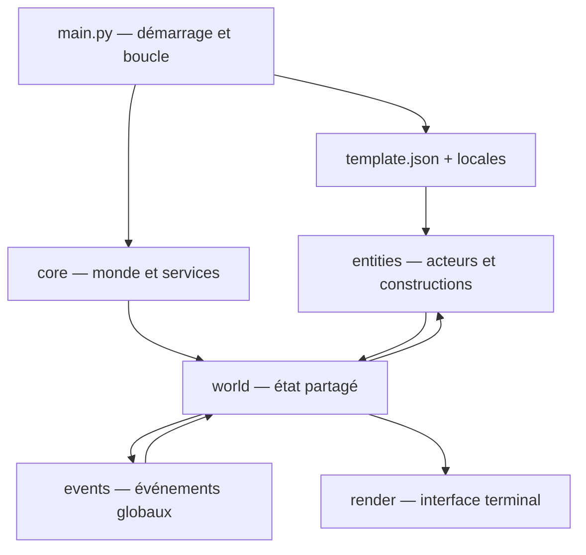

# Référentiel technique de Chartographist

Ce document est la carte de travail du dépôt. Il sert à retrouver rapidement le point d'entrée, le propriétaire d'une responsabilité, les données partagées et les fichiers à modifier ensemble.

Les règles impératives de contribution sont définies dans [`AGENTS.md`](AGENTS.md) : prévention des régressions, i18n systématique et tests obligatoires pour chaque modification.

> État analysé : branche `develop`, le 22 août 2026. Le projet est une simulation Python terminal. Une suite `unittest` de non-régression est disponible sous [`tests/`](tests/).

## Vue d'ensemble

Le programme construit un monde déterministe à partir d'une graine et de [`template.json`](template.json), puis exécute une boucle mensuelle qui met à jour la géographie, les entités, les événements et l'affichage terminal.



Ordre d'initialisation à préserver :

1. lecture des arguments, de la locale et du template ;
2. initialisation de [`RandomService`](core/random_service.py) ;
3. génération des religions, espèces humanoïdes et espèces animales ;
4. assemblage de la géographie et des services du monde ;
5. création de la grille spatiale et des villes initiales ;
6. création du moteur de rendu, puis entrée dans la boucle.

## Contrats structurants

### État global `world`

Créé par [`core/world_factory.py`](core/world_factory.py), complété dans [`main.py`](main.py), puis transmis à presque tous les systèmes :

| Clé | Type / rôle | Propriétaire principal |
|---|---|---|
| `width`, `height` | dimensions de la carte | `world_factory.py` |
| `seed`, `cycle` | reproductibilité et horloge mensuelle | `world_factory.py`, `main.py` |
| `elev`, `riv`, `plates` | relief NumPy, rivières et plaques | `core/geo.py` |
| `road` | grille mutable des routes | `world_factory.py`, `history/history_engine.py` |
| `entities` | instance de `EntityManager` | `core/entities.py` |
| `influence` | cartes de peur et d'odeur | `core/influence.py` |
| `grid` | index spatial reconstruit à chaque cycle | `core/grid_service.py`, ajouté par `main.py` |

L'objet `stats` construit par `world_factory` contient initialement `year`, `seed` et `logs`. `main.py` ajoute `month` dès le premier cycle, avant le premier rendu normal ; le reveal initial n'utilise que `seed`. Toute nouvelle clé consommée par le rendu doit être initialisée avant la frame qui l'utilise.

### Cadences de simulation

La boucle dans [`main.py`](main.py) applique trois fréquences :

- chaque cycle : grille, apparition de faune, `process_turn()`, événements, nettoyage et rendu ;
- tous les 10 cycles : décroissance des influences, projection d'influence et signes vitaux ;
- tous les 100 cycles : reproduction et logique de long terme.

### Déterminisme

Toute décision aléatoire de simulation doit passer par [`core/random_service.py`](core/random_service.py). L'usage direct de `random` est réservé à la création d'une graine quand l'utilisateur n'en fournit pas. [`core/system.py`](core/system.py) conserve les graines numériques telles quelles et transforme les graines textuelles par les huit premiers octets de SHA-256 : leur valeur est donc stable entre processus et indépendante de `PYTHONHASHSEED`.

### Entités actives

La hiérarchie réellement utilisée est :

```text
Entity
├── Human
│   ├── Farmer
│   ├── Fisherman
│   ├── Hunter
│   ├── Settler
│   ├── Soldier
│   └── Trader
├── Animal (toutes les espèces sont des données de template.json)
├── Construct
│   ├── City
│   ├── Village
│   └── Ruins
└── UFO
```

[`entities/actor.py`](entities/actor.py) définit une classe `Actor`, mais `Human` et `Animal` héritent directement de `Entity`. La considérer comme historique tant qu'elle n'est pas réintégrée explicitement.

## Carte des fichiers

### Racine et configuration

| Fichier | Rôle | À modifier avec |
|---|---|---|
| [`AGENTS.md`](AGENTS.md) | Directives obligatoires pour toute intervention : compatibilité, i18n et stratégie de tests. | À mettre à jour lorsque la politique de contribution évolue. |
| [`tests/`](tests/) | Suite `unittest` de non-régression et tests d'architecture. | À étendre avec toute modification fonctionnelle, de configuration ou d'i18n. |
| [`main.py`](main.py) | Point d'entrée, initialisation, boucle de simulation, clavier, arrêt et chroniques finales. | Les contrats `world`/`stats`, le rendu et les cadences d'entités. |
| [`template.json`](template.json) | Source de vérité des cultures, biomes, domaines religieux, archétypes d'espèces et de faune, seuils et probabilités. | Les lecteurs concernés dans `core/`, `entities/` et les libellés de `locales/`. |
| [`requirements.txt`](requirements.txt) | Dépendances d'exécution : `noise`, `colorama`, `numpy`. | L'environnement d'installation et le README. |
| [`README.md`](README.md) | Présentation utilisateur, installation et aperçu historique de l'arborescence. | À synchroniser après un changement fonctionnel visible. Sa liste de fichiers animaux séparés est obsolète. |
| [`CLAUDE.md`](CLAUDE.md) | Notes d'architecture et conventions locales pour assistants. | À synchroniser avec le présent référentiel si les invariants changent. Fichier actuellement non suivi par Git. |
| [`.gitignore`](.gitignore) | Exclusions Git génériques Python et outils. | Nouveaux artefacts générés. |
| [`LICENSE`](LICENSE) | Licence Apache 2.0. | Rarement modifié. |
| [`.claude/settings.local.json`](.claude/settings.local.json) | Préférences locales d'outillage Claude. | Ne porte pas de logique applicative. |

### Noyau `core/`

| Fichier | Responsabilité |
|---|---|
| [`core/__init__.py`](core/__init__.py) | Façade exportant l'assemblage du monde et les fonctions terminal/CLI consommées par `main.py`. |
| [`core/system.py`](core/system.py) | Mode terminal ANSI/cbreak, restauration du terminal, arguments i18n `--seed`, `--template`, `--lang`, graine textuelle stable, chargement locale/config. |
| [`core/world_factory.py`](core/world_factory.py) | Construit le dictionnaire `world` et `stats`; branche géologie, hydrologie, gestionnaire d'entités et influences. |
| [`core/geo.py`](core/geo.py) | Génère le relief Perlin/NumPy, les plaques et les rivières par descente locale. |
| [`core/entities.py`](core/entities.py) | Classe `Entity`, z-index, compteur d'action fondé sur la vitesse, projection d'influence et collection `EntityManager`. |
| [`core/grid_service.py`](core/grid_service.py) | Index spatial en cellules pour limiter les recherches de voisins. Renvoie des candidats, pas une distance exacte. |
| [`core/influence.py`](core/influence.py) | Heatmaps persistantes de peur (minimum négatif) et d'odeur (cumulative), avec décroissance. |
| [`core/random_service.py`](core/random_service.py) | PRNG centralisé et déterministe, plus raccourcis `choice`, `randint`, `uniform`, `sample`, `shuffle`. |
| [`core/logger.py`](core/logger.py) | Tampon global des messages produits par la simulation et vidés vers `stats['logs']`. |
| [`core/translator.py`](core/translator.py) | Charge une locale JSON, se replie sur l'anglais si elle manque et résout les chemins pointés (`a.b.c`) avec formatage. |
| [`core/config_validator.py`](core/config_validator.py) | Valide les sections et types structurants du template ; lève `ConfigValidationError` avec des codes d'erreur stables. |
| [`core/culture.py`](core/culture.py) | Charge le template JSON, délègue sa validation structurelle et traduit les erreurs de chargement. |
| [`core/naming.py`](core/naming.py) | Génération déterministe des noms de personnes, prénoms et lieux à partir d'une culture. |
| [`core/discovery_service.py`](core/discovery_service.py) | Recherche globale des colonies actives et de la colonie valide la plus proche. |
| [`core/fauna_gen.py`](core/fauna_gen.py) | Transforme les `fauna_archetypes` du template en dictionnaires d'espèces animales jouables. |
| [`core/species.py`](core/species.py) | Génère une espèce humanoïde par culture (origine × physiologie × nature) et expose `PersonalSpecies`. |
| [`core/religion.py`](core/religion.py) | Génère les religions, foi individuelle, démographie religieuse, bonus et syncrétisme. Maintient un état de module initialisé au démarrage. |
| [`core/bestiary_tracker.py`](core/bestiary_tracker.py) | Compteurs en mémoire des morts par chasse et famine, utilisés par le bestiaire. |

### Entités `entities/`

| Fichier | Responsabilité |
|---|---|
| [`entities/__init__.py`](entities/__init__.py) | Importe certains modules pour déclencher leurs enregistrements. Il ne garantit pas à lui seul l'import de tous les rôles. |
| [`entities/registry.py`](entities/registry.py) | Catalogues globaux `WILD_SPECIES`, `CIV_UNITS`, `STRUCTURE_TYPES` alimentés par décorateurs. |
| [`entities/spawn_system.py`](entities/spawn_system.py) | Régule la population animale depuis `config['fauna']` et place les villes mères sur terrain habitable près d'une rivière. |
| [`entities/actor.py`](entities/actor.py) | Ancienne abstraction mobile avec culture, âge et durée de vie ; non utilisée par la hiérarchie active. |

#### Constructions

| Fichier | Responsabilité |
|---|---|
| [`entities/constructs/base.py`](entities/constructs/base.py) | Base `Construct` : culture, noms, citoyens, reproduction, parenté, dérive culturelle, espèces et syncrétisme religieux. |
| [`entities/constructs/city.py`](entities/constructs/city.py) | Ville mature : population, expansion, commerce, spécialisation, guerres, soldats, dégâts et effondrement en ruines. |
| [`entities/constructs/village.py`](entities/constructs/village.py) | Colonie initiale : citoyens, fermiers/chasseurs/pêcheurs, foi et évolution en ville. |
| [`entities/constructs/ruins.py`](entities/constructs/ruins.py) | Vestige inactif d'une colonie détruite. |

#### Humains

| Fichier | Responsabilité |
|---|---|
| [`entities/species/human/base.py`](entities/species/human/base.py) | Base `Human` : identité, culture, famille, âge, fertilité, foi, espèce et comportement générique. |
| [`entities/species/human/farmer.py`](entities/species/human/farmer.py) | Produit des ressources pour sa colonie, avec bonus de récolte. |
| [`entities/species/human/fisherman.py`](entities/species/human/fisherman.py) | Cherche les zones de pêche, navigue côte/eau, capture et rapporte les proies aquatiques. |
| [`entities/species/human/hunter.py`](entities/species/human/hunter.py) | Détecte et chasse la faune, combat, livre de la nourriture et alimente le bestiaire. |
| [`entities/species/human/settler.py`](entities/species/human/settler.py) | Explore le terrain, choisit un site, fonde un village et trace une route d'origine. |
| [`entities/species/human/soldier.py`](entities/species/human/soldier.py) | Identifie les cultures ennemies, combat les unités et attaque les villes en guerre. |
| [`entities/species/human/trader.py`](entities/species/human/trader.py) | Choisit une destination, commerce, crée des connexions routières et diffuse les religions. |
| [`entities/species/human/__init__.py`](entities/species/human/__init__.py) | Réexporte `Settler` et `Hunter`; les autres rôles sont importés par leurs consommateurs directs. |

#### Animaux et entités spéciales

| Fichier | Responsabilité |
|---|---|
| [`entities/species/animal/base.py`](entities/species/animal/base.py) | Classe animale générique pilotée par données : spawn par altitude/locomotion, faim, reproduction, prédation, fuite, influence et déplacement. |
| [`entities/special/ufo.py`](entities/special/ufo.py) | Entité temporaire de l'événement d'enlèvement : cible, emporte, libère et quitte la carte. |
| [`entities/species/__init__.py`](entities/species/__init__.py) | Marqueur de package vide. |
| [`entities/species/animal/__init__.py`](entities/species/animal/__init__.py) | Marqueur de package vide. |

### Événements `events/`

| Fichier | Responsabilité |
|---|---|
| [`events/__init__.py`](events/__init__.py) | Auto-découvre et importe les modules `.py`, ce qui déclenche les décorateurs d'enregistrement. |
| [`events/base_event.py`](events/base_event.py) | Contrat `condition`, `trigger`, `tick` et probabilité de base des événements. |
| [`events/event_registry.py`](events/event_registry.py) | Catalogue singleton d'instances d'événements via `@register_event`. |
| [`events/event_manager.py`](events/event_manager.py) | À chaque cycle, exécute `tick`, tire la probabilité, vérifie la condition et déclenche l'événement. |
| [`events/abduction.py`](events/abduction.py) | Déclenche l'arrivée d'un UFO et les enlèvements de civils. |
| [`events/epidemic.py`](events/epidemic.py) | Infecte villes et humains, propage la maladie, applique la mortalité et peut produire des ruines. |
| [`events/volcano.py`](events/volcano.py) | Éruption sur relief adapté, dégâts radiaux persistants et destruction de colonies. |

Point de vigilance : la liste d'exclusion dans `events/__init__.py` nomme `registry.py` et `manager.py`, alors que les fichiers réels sont `event_registry.py` et `event_manager.py`. Leur import dynamique est actuellement redondant mais fonctionne grâce au cache d'import Python.

### Historique et routes

| Fichier | Responsabilité |
|---|---|
| [`history/history_engine.py`](history/history_engine.py) | Trace une route entre deux positions dans la grille `world['road']`. Utilisé par colons et marchands. |
| [`history/__init__.py`](history/__init__.py) | Marqueur de package vide. |

### Rendu `render/`

| Fichier | Responsabilité |
|---|---|
| [`render/render_engine.py`](render/render_engine.py) | Orchestre l'en-tête, la carte, les logs, le reveal initial et l'écran bestiaire. |
| [`render/ui_map.py`](render/ui_map.py) | Choisit le caractère visible par tuile selon z-index, routes, eau/relief/biome et anime le reveal radial. |
| [`render/ui_header.py`](render/ui_header.py) | Affiche temps, population et synthèse religieuse. |
| [`render/ui_logs.py`](render/ui_logs.py) | Affiche les derniers messages de `stats['logs']`. |
| [`render/ui_bestiary.py`](render/ui_bestiary.py) | Interface paginée faune/espèces/religions/colonies/guide et résumé final. |
| [`render/__init__.py`](render/__init__.py) | Réexporte `RenderEngine`. |

### Localisation

| Fichier | Rôle |
|---|---|
| [`locales/textes.fr.json`](locales/textes.fr.json) | Texte français, langue par défaut. |
| [`locales/textes.en.json`](locales/textes.en.json) | Traduction anglaise. |
| [`locales/textes.es.json`](locales/textes.es.json) | Traduction espagnole. |

Les trois fichiers doivent garder les mêmes chemins de clés. Toute nouvelle chaîne visible doit être ajoutée aux trois locales et appelée via `Translator.translate(...)`.

## Base de tests et connaissances confirmées

Commande canonique :

```bash
python3 -m unittest discover -s tests -v
```

La suite contient 49 tests et s'organise ainsi :

| Fichier | Couverture |
|---|---|
| [`tests/test_core_services.py`](tests/test_core_services.py) | PRNG, logger, bestiaire, chargement de configuration, traduction, noms, grille spatiale, influences, compteur d'action, gestionnaire d'entités et routes. |
| [`tests/test_i18n_and_architecture.py`](tests/test_i18n_and_architecture.py) | Parité des 195 clés i18n, parité des placeholders, existence des clés littérales utilisées, restriction des imports `random`, schéma du template et importabilité de tous les modules. |
| [`tests/test_generation.py`](tests/test_generation.py) | Déterminisme et contrats de géologie, hydrologie, faune, espèces humanoïdes, religions et assemblage du monde. |
| [`tests/test_entities_and_spawn.py`](tests/test_entities_and_spawn.py) | Registres actifs, propriétés/spawn/famine/reproduction animale, capacité maximale de faune, biologie humaine et contrat d'initialisation d'un village. |
| [`tests/test_events_render_and_smoke.py`](tests/test_events_render_and_smoke.py) | Catalogue et cycle des événements, priorité du rendu, contrat d'en-tête et pipeline intégré de 25 cycles. |
| [`tests/test_phase0_stability.py`](tests/test_phase0_stability.py) | Graines textuelles stables, vieillissement mensuel, i18n des ruines/syncrétisme/CLI, repli de locale, découverte d'événements, relief plat et validation du template. |
| [`tests/__init__.py`](tests/__init__.py) | Marque le répertoire comme package de tests. |

Contrats désormais protégés :

- une même graine, entière ou textuelle, rejoue les mêmes séquences aléatoires et les mêmes générations procédurales entre processus ;
- le relief est une matrice `(height, width)` normalisée de `-1` à `1` ;
- l'hydrologie conserve la forme du relief et ne produit que des valeurs positives ou nulles ;
- la génération crée une religion et une espèce humanoïde par culture ;
- le nombre d'espèces animales générées est la somme des `count` de `fauna_archetypes` ;
- `SpatialGrid.get_nearby()` renvoie des candidats par cellules, sans filtrage final de distance ;
- le compteur d'action peut déclencher plusieurs `update()` dans un cycle quand `speed > 1` ;
- les influences positives s'additionnent, les peurs conservent la valeur la plus négative, puis les deux décroissent ;
- la découverte d'événements ignore explicitement les modules d'infrastructure et le registre contient une instance unique de `Abduction`, `Epidemic` et `VolcanoEruption` ;
- l'ordre d'un événement est `tick` → tirage de probabilité → `condition` → `trigger` ;
- le rendu d'une case suit la priorité entité par z-index → route → rivière → biome ;
- les trois locales possèdent actuellement 195 feuilles, les mêmes chemins de clés et les mêmes placeholders de formatage ;
- les imports directs de `random` sont confinés à `core/random_service.py` et à la génération initiale de graine dans `core/system.py`.

### États globaux à réinitialiser dans les tests

Plusieurs modules conservent un état de processus :

- `RandomService._rng` ;
- `GameLogger._logs` ;
- les compteurs de `core.bestiary_tracker` ;
- les templates de `core.religion` et `core.species` ;
- `EVENT_CATALOG` et les catalogues de `entities.registry` alimentés à l'import.

Tout nouveau test qui les modifie doit les initialiser ou les isoler pour rester indépendant de l'ordre d'exécution.

### Stabilisation phase 0 (22 août 2026)

Les garde-fous suivants sont maintenant implémentés et testés :

- les graines textuelles utilisent un mapping SHA-256 stable entre processus ;
- un humain mobile vieillit de `1/12` au plus une fois par cycle, indépendamment de sa vitesse ;
- les ruines, les religions syncrétiques, les erreurs de locale/configuration/entité et l'aide CLI passent par les trois catalogues i18n ;
- une locale absente se replie sur l'anglais sans laisser le traducteur vide ;
- l'auto-découverte exclut les quatre modules d'infrastructure des événements ;
- un relief constant produit une matrice neutre finie au lieu d'une division par zéro ;
- le chargement JSON valide les sections structurantes avant la génération du monde.

### Risques et dettes techniques connus

- `WILD_SPECIES` existe dans le registre mais la faune active est une classe `Animal` générique pilotée par `template.json`; ne pas réintroduire des sous-classes sans décision d'architecture explicite.
- Quelques valeurs de secours internes historiques (`Unknown`, `Unknown Lands`, `WORLD`) subsistent pour des configurations déjà dégradées. Si elles deviennent des textes d'interface modifiés ou étendus, elles doivent migrer vers les trois catalogues avec tests.

## Où intervenir selon le changement

| Besoin | Point de départ | Fichiers généralement associés |
|---|---|---|
| Modifier la cadence ou le déroulement d'un tour | [`main.py`](main.py) | `core/entities.py`, `events/event_manager.py`, rendu |
| Ajouter une donnée globale au monde | [`core/world_factory.py`](core/world_factory.py) | Tous les consommateurs et le rendu |
| Changer relief, eau ou biomes | [`core/geo.py`](core/geo.py) | `render/ui_map.py`, règles de spawn, `template.json` |
| Ajouter/modifier une espèce animale | [`template.json`](template.json) | `core/fauna_gen.py`, `entities/species/animal/base.py`, locales/bestiaire |
| Ajouter un rôle humain | nouveau fichier sous `entities/species/human/` | registre/imports, ville ou village qui le crée, rendu/locales |
| Changer reproduction, famille ou culture | [`entities/constructs/base.py`](entities/constructs/base.py) | `human/base.py`, `core/species.py`, `core/religion.py` |
| Changer villes, commerce ou guerre | [`entities/constructs/city.py`](entities/constructs/city.py) | `trader.py`, `soldier.py`, `history_engine.py` |
| Ajouter un événement | sous-classe dans `events/` + `@register_event` | `template.json` pour ses paramètres et les trois locales |
| Modifier l'affichage général | [`render/render_engine.py`](render/render_engine.py) | module `ui_*` concerné, `main.py` pour les contrôles |
| Ajouter une langue | nouveau `locales/textes.<lang>.json` | aide CLI/README si la langue est officiellement supportée |

## Vérifications minimales avant modification

Toute modification fonctionnelle doit introduire ou adapter des tests sous `tests/`, conformément à [`AGENTS.md`](AGENTS.md). Pour limiter les régressions :

1. vérifier que tous les imports Python compilent ;
2. lancer deux fois une courte simulation avec la même graine et comparer le comportement ;
3. tester `--lang fr`, `en` et `es` après tout changement de texte ;
4. vérifier le retour du curseur et du terminal après `Ctrl+C` et après une exception ;
5. pour une nouvelle entité, contrôler son import/enregistrement, son z-index, son nettoyage via `is_expired`, son accès à la grille et sa représentation dans le rendu ;
6. pour une nouvelle clé de template, prévoir une valeur par défaut afin de ne pas casser les anciens templates.
7. pour tout texte visible, vérifier la parité des clés françaises, anglaises et espagnoles ainsi que leur formatage par `Translator`.

## Commandes utiles

```bash
pip install -r requirements.txt
python main.py --seed 42 --template template.json --lang fr
python3 -m compileall -q .
python3 -m unittest discover -s tests -v
```

La simulation va jusqu'à 2 000 cycles avec une pause de 0,15 seconde par cycle. Pour un diagnostic rapide, ajuster temporairement les constantes de [`main.py`](main.py) dans une branche de travail, puis restaurer leurs valeurs avant livraison.
