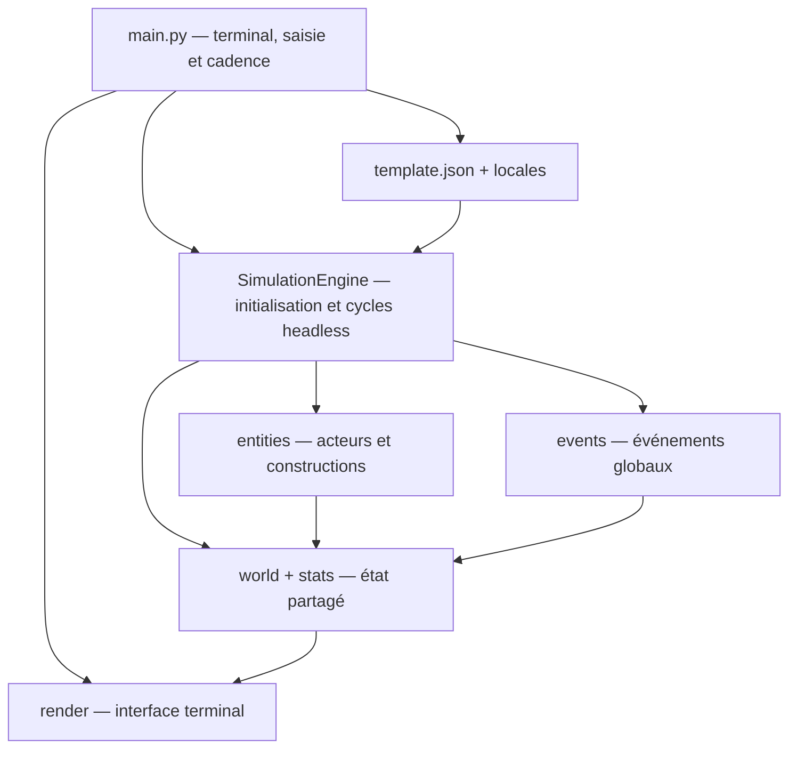

# Référentiel technique de Chartographist

Ce document est la carte de travail du dépôt. Il sert à retrouver rapidement le point d'entrée, le propriétaire d'une responsabilité, les données partagées et les fichiers à modifier ensemble.

Les règles impératives de contribution sont définies dans [`AGENTS.md`](AGENTS.md) : prévention des régressions, i18n systématique et TDD strict test-first pour chaque modification fonctionnelle.

> État analysé : branche `evolution`, le 23 août 2026. Le projet est une simulation Python terminal. Une suite `unittest` de non-régression est disponible sous [`tests/`](tests/).

## Vue d'ensemble

Le programme construit un monde déterministe à partir d'une graine et de [`template.json`](template.json), puis exécute une boucle mensuelle qui met à jour la géographie, les entités, l'économie, les événements et l'affichage terminal.



Ordre d'initialisation à préserver :

1. `main.py` lit les arguments, la locale et le template ;
2. `SimulationEngine.create()` initialise [`RandomService`](core/random_service.py) ;
3. le moteur génère religions, espèces humanoïdes et espèces animales ;
4. le moteur assemble géographie et services du monde ;
5. le moteur crée la grille spatiale et les villes initiales ;
6. `main.py` crée le moteur de rendu, puis appelle `SimulationEngine.step()` à chaque frame.

## Contrats structurants

### État global `world`

Créé par [`core/world_factory.py`](core/world_factory.py), complété et possédé par [`core/simulation_engine.py`](core/simulation_engine.py), puis transmis à presque tous les systèmes :

| Clé | Type / rôle | Propriétaire principal |
|---|---|---|
| `width`, `height` | dimensions de la carte | `world_factory.py` |
| `seed`, `cycle` | reproductibilité et horloge mensuelle | `world_factory.py`, `simulation_engine.py` |
| `elev`, `riv`, `plates` | relief NumPy, rivières et plaques | `core/geo.py` |
| `road` | grille mutable des routes | `world_factory.py`, `history/history_engine.py` |
| `entities` | instance de `EntityManager` | `core/entities.py` |
| `influence` | cartes de peur et d'odeur | `core/influence.py` |
| `grid` | index spatial reconstruit à chaque cycle | `core/grid_service.py`, ajouté par `SimulationEngine.create()` |
| `chronicles` | liste durable d’entrées structurées : ID, date, catégorie, message, IDs liés et position | `core/chronicles.py`, alimenté par `SimulationEngine` |
| `next_chronicle_id` | prochain identifiant monotone de chronique | `core/chronicles.py` |
| `diplomacy` | dictionnaire de relations symétriques indexées par paire canonique d’`entity_id` | `core/diplomacy.py` |
| `next_relation_id` | prochain identifiant monotone de relation | `core/diplomacy.py` |
| `climate` | saison, anomalies thermiques/pluviométriques, sécheresse, crue et dernier cycle traité | `core/climate.py` |

L'objet `stats` construit par `world_factory` contient initialement `year`, `seed` et `logs`. `SimulationEngine.step()` ajoute `month` dès le premier cycle, avant le premier rendu normal ; le reveal initial n'utilise que `seed`. Toute nouvelle clé consommée par le rendu doit être initialisée avant la frame qui l'utilise.

### Cadences de simulation

[`SimulationEngine.step()`](core/simulation_engine.py) applique trois fréquences :

- chaque cycle : climat et anomalies, diplomatie globale, grille, apparition de faune, `process_turn()`, événements, synchronisation des logs et nettoyage ; `main.py` effectue ensuite le rendu ;
- tous les 12 cycles : usure des guerres, création des trêves arrivées à maturité, aide alimentaire alliée et synchronisation de l’adaptateur historique `City.enemies` ;
- tous les 10 cycles : décroissance des influences, projection d'influence et signes vitaux ;
- tous les 100 cycles : reproduction et logique de long terme.

### Déterminisme

Toute décision aléatoire de simulation doit passer par [`core/random_service.py`](core/random_service.py). L'usage direct de `random` est réservé à la création d'une graine quand l'utilisateur n'en fournit pas. [`core/system.py`](core/system.py) conserve les graines numériques telles quelles et transforme les graines textuelles par les huit premiers octets de SHA-256 : leur valeur est donc stable entre processus et indépendante de `PYTHONHASHSEED`.

### Entités actives

La hiérarchie réellement utilisée est :

```text
Entity
├── Human
│   ├── Farmer
│   ├── Fisherman
│   ├── Hunter
│   ├── Settler
│   ├── Soldier
│   └── Trader
├── Animal (toutes les espèces sont des données de template.json)
├── Construct
│   ├── City
│   ├── Village
│   └── Ruins
└── UFO
```

[`entities/actor.py`](entities/actor.py) définit une classe `Actor`, mais `Human` et `Animal` héritent directement de `Entity`. La considérer comme historique tant qu'elle n'est pas réintégrée explicitement.

### Compte économique des établissements

Chaque `City` et `Village` possède un dictionnaire `economy`, initialisé ou migré paresseusement par [`core/economy.py`](core/economy.py). Il contient trésorerie, nourriture importée/exportée, richesse dépensée/gagnée, nombre de transactions et dernier prix alimentaire. `food_stock` et `max_food` restent les sources de vérité historiques pour la nourriture.

Lorsque `config['economy']['enabled']` vaut `true`, un marchand transfère réellement un surplus alimentaire de l'origine vers la destination et la destination paie au prix calculé selon sa pénurie. Nourriture et richesse sont conservées pendant la transaction. Sans section économique ou avec `enabled: false`, le bonus alimentaire historique du marchand est conservé.

### Relations diplomatiques

`core/diplomacy.py` conserve dans `world['diplomacy']` une relation unique et symétrique par paire canonique d’identifiants stables (`min_id:max_id`). Une relation contient `relation_id`, les deux IDs, `status`, `trust`, `tension`, `interdependence`, le dernier cycle de changement, les bornes de guerre/trêve et une liste de raisons structurées.

La machine d’états reconnaît `neutral`, `trade_pact`, `alliance`, `hostile`, `war` et `truce`. Une alliance et une trêve active interdisent la guerre directe ; une guerre se termine par une trêve temporisée, puis revient à la neutralité. Les requêtes renvoient toujours des copies défensives.

Quand `config['diplomacy']['enabled']` vaut `true` :

- un commerce réussi augmente confiance et interdépendance et peut créer un pacte commercial puis une alliance ;
- un pacte ou une alliance augmente la capacité des échanges suivants ;
- la guerre bloque le transfert commercial direct ;
- tension et hostilité augmentent la probabilité historique de déclaration, dont le tirage reste assuré par `RandomService` ;
- l’usure met fin aux guerres après `war_min_duration`, les soldats se replient et `City.enemies` est synchronisé pour compatibilité ;
- une alliance peut transférer une aide alimentaire bornée, sans création de nourriture.

`SimulationEngine.get_relationship()`, `get_relationships()` et `get_diplomatic_summary()` exposent ce modèle en mode headless. `inspect_entity()` inclut les relations de l’entité. Les événements sont journalisés avec les deux IDs en catégorie `diplomacy`, alimentent les chroniques et sont visibles dans l’onglet terminal `[D] Diplomatie`. Les mondes et checkpoints antérieurs sans stockage diplomatique sont migrés paresseusement ; leurs guerres actives présentes dans `City.enemies` sont converties sans perte.

## Carte des fichiers

### Racine et configuration

| Fichier | Rôle | À modifier avec |
|---|---|---|
| [`AGENTS.md`](AGENTS.md) | Directives obligatoires pour toute intervention : compatibilité, i18n et stratégie de tests. | À mettre à jour lorsque la politique de contribution évolue. |
| [`tests/`](tests/) | Suite `unittest` de non-régression et tests d'architecture. | À étendre avec toute modification fonctionnelle, de configuration ou d'i18n. |
| [`main.py`](main.py) | Adaptateur terminal : arguments, chargement/sauvegarde, clavier, rendu, temporisation, arrêt et résumé final. | `core/simulation_engine.py`, `core/persistence.py`, rendu et contrôles utilisateur. |
| [`template.json`](template.json) | Source de vérité des cultures, biomes, domaines religieux, archétypes d'espèces et de faune, seuils et probabilités. | Les lecteurs concernés dans `core/`, `entities/` et les libellés de `locales/`. |
| [`requirements.txt`](requirements.txt) | Dépendances d'exécution : `noise`, `colorama`, `numpy`. | L'environnement d'installation et le README. |
| [`README.md`](README.md) | Présentation utilisateur, installation et aperçu historique de l'arborescence. | À synchroniser après un changement fonctionnel visible. Sa liste de fichiers animaux séparés est obsolète. |
| [`CLAUDE.md`](CLAUDE.md) | Notes d'architecture et conventions locales pour assistants. | À synchroniser avec le présent référentiel si les invariants changent. Fichier actuellement non suivi par Git. |
| [`.gitignore`](.gitignore) | Exclusions Git génériques Python et outils. | Nouveaux artefacts générés. |
| [`LICENSE`](LICENSE) | Licence Apache 2.0. | Rarement modifié. |
| [`.claude/settings.local.json`](.claude/settings.local.json) | Préférences locales d'outillage Claude. | Ne porte pas de logique applicative. |

### Noyau `core/`

| Fichier | Responsabilité |
|---|---|
| [`core/__init__.py`](core/__init__.py) | Façade exportant l'assemblage du monde et les fonctions terminal/CLI consommées par `main.py`. |
| [`core/system.py`](core/system.py) | Mode terminal ANSI/cbreak, restauration, `LaunchOptions`, arguments i18n `--seed`, `--template`, `--lang`, `--load`, `--save`, graine stable et chargement locale/config. |
| [`core/world_factory.py`](core/world_factory.py) | Construit le dictionnaire `world` et `stats`; branche géologie, hydrologie, gestionnaire d'entités et influences. |
| [`core/simulation_engine.py`](core/simulation_engine.py) | Moteur headless : initialise et possède `world`/`stats`, exécute `step()`/`run()`, isole les erreurs et expose sauvegarde, chroniques, inspection, climat par monde/tuile, agrégats économique et diplomatique. |
| [`core/climate.py`](core/climate.py) | Service headless du cycle saisonnier, température, humidité, biomes, anomalies, productivité agricole/écologique et compatibilité de rendu historique. |
| [`core/persistence.py`](core/persistence.py) | Checkpoint binaire atomique, en-tête/version, capture et restauration du moteur, PRNG, événements, catalogues procéduraux, IDs. logs bestiaire séquence'IDs. |
| [`core/entity_ids.py`](core/entity_ids.py) | Séquence déterministe des `entity_id`, réinitialisable pour un monde neuf et restaurable depuis un checkpoint. |
| [`core/economy.py`](core/economy.py) | Comptes économiques paresseux, prix alimentaire borné par la pénurie, transaction conservatrice, débit sécurisé, snapshots et agrégat mondial headless. |
| [`core/diplomacy.py`](core/diplomacy.py) | Registre persistant par IDs stables, métriques et transitions, effets commerce/guerre/alliance, trêves, aide conservatrice, synchronisation legacy et agrégat headless. |
| [`core/chronicles.py`](core/chronicles.py) | `ChronicleBook` initialise, ajoute et filtre l’historique structuré stocké dans `world`, en renvoyant des copies. |
| [`core/inspection.py`](core/inspection.py) | Produit un instantané de lecture d’une entité trouvée par `entity_id` ses chroniques et ses relations diplomatiques associées. |
| [`core/geo.py`](core/geo.py) | Génère le relief Perlin/NumPy, les plaques et les rivières par descente locale. |
| [`core/entities.py`](core/entities.py) | Classe `Entity` avec `entity_id` persistant, transfert d'identité, z-index, compteur d'action, influence et `EntityManager`. |
| [`core/grid_service.py`](core/grid_service.py) | Index spatial en cellules pour limiter les recherches de voisins. Renvoie des candidats, pas une distance exacte. |
| [`core/influence.py`](core/influence.py) | Heatmaps persistantes de peur (minimum négatif) et d'odeur (cumulative), avec décroissance. |
| [`core/random_service.py`](core/random_service.py) | PRNG centralisé et déterministe, raccourcis aléatoires et capture/restauration de son état pour les checkpoints. |
| [`core/logger.py`](core/logger.py) | Tampon global rétrocompatible : renvoie toujours des chaînes vers `stats['logs']`, avec contexte facultatif catégorie/IDs/position consommé par les chroniques. |
| [`core/translator.py`](core/translator.py) | Charge une locale JSON, se replie sur l'anglais si elle manque et résout les chemins pointés (`a.b.c`) avec formatage. |
| [`core/config_validator.py`](core/config_validator.py) | Valide les sections et types structurants du template, y compris les bornes économiques, diplomatiques et climatiques ; lève `ConfigValidationError` avec des codes d'erreur stables. |
| [`core/culture.py`](core/culture.py) | Charge le template JSON, délègue sa validation structurelle et traduit les erreurs de chargement. |
| [`core/naming.py`](core/naming.py) | Génération déterministe des noms de personnes, prénoms et lieux à partir d'une culture. |
| [`core/discovery_service.py`](core/discovery_service.py) | Recherche globale des colonies actives et de la colonie valide la plus proche. |
| [`core/fauna_gen.py`](core/fauna_gen.py) | Transforme les `fauna_archetypes` du template en dictionnaires d'espèces animales jouables. |
| [`core/species.py`](core/species.py) | Génère une espèce humanoïde par culture (origine × physiologie × nature) et expose `PersonalSpecies`. |
| [`core/religion.py`](core/religion.py) | Génère les religions, foi individuelle, démographie religieuse, bonus et syncrétisme. Maintient un état de module initialisé au démarrage. |
| [`core/bestiary_tracker.py`](core/bestiary_tracker.py) | Compteurs en mémoire des morts par chasse et famine, utilisés par le bestiaire. |

### Entités `entities/`

| Fichier | Responsabilité |
|---|---|
| [`entities/__init__.py`](entities/__init__.py) | Importe certains modules pour déclencher leurs enregistrements. Il ne garantit pas à lui seul l'import de tous les rôles. |
| [`entities/registry.py`](entities/registry.py) | Catalogues globaux `WILD_SPECIES`, `CIV_UNITS`, `STRUCTURE_TYPES` alimentés par décorateurs. |
| [`entities/spawn_system.py`](entities/spawn_system.py) | Régule la population animale depuis `config['fauna']` et place les villes mères sur terrain habitable près d'une rivière. |
| [`entities/actor.py`](entities/actor.py) | Ancienne abstraction mobile avec culture, âge et durée de vie ; non utilisée par la hiérarchie active. |

#### Constructions

| Fichier | Responsabilité |
|---|---|
| [`entities/constructs/base.py`](entities/constructs/base.py) | Base `Construct` : culture, noms, citoyens, reproduction, parenté, dérive culturelle, espèces et syncrétisme religieux. |
| [`entities/constructs/city.py`](entities/constructs/city.py) | Ville mature : population, expansion financée, commerce, spécialisation, déclaration de guerre compatible avec les traités, soldats, dégâts et ruines. |
| [`entities/constructs/village.py`](entities/constructs/village.py) | Colonie initiale : citoyens, fermiers/chasseurs/pêcheurs, foi et évolution en ville. |
| [`entities/constructs/ruins.py`](entities/constructs/ruins.py) | Vestige inactif d'une colonie détruite. |

#### Humains

| Fichier | Responsabilité |
|---|---|
| [`entities/species/human/base.py`](entities/species/human/base.py) | Base `Human` : identité, culture, famille, âge, fertilité, foi, espèce et comportement générique. |
| [`entities/species/human/farmer.py`](entities/species/human/farmer.py) | Produit des ressources pour sa colonie, avec bonus de récolte. |
| [`entities/species/human/fisherman.py`](entities/species/human/fisherman.py) | Cherche les zones de pêche, navigue côte/eau, capture et rapporte les proies aquatiques. |
| [`entities/species/human/hunter.py`](entities/species/human/hunter.py) | Détecte et chasse la faune, combat, livre de la nourriture et alimente le bestiaire. |
| [`entities/species/human/settler.py`](entities/species/human/settler.py) | Explore le terrain, choisit un site, fonde un village et trace une route d'origine. |
| [`entities/species/human/soldier.py`](entities/species/human/soldier.py) | Identifie les cultures ennemies, combat les unités, attaque les villes en guerre et se replie après une trêve. |
| [`entities/species/human/trader.py`](entities/species/human/trader.py) | Choisit une destination, transfère les surplus, développe les relations diplomatiques, respecte les guerres, crée les routes et diffuse les religions. |
| [`entities/species/human/__init__.py`](entities/species/human/__init__.py) | Réexporte `Settler` et `Hunter`; les autres rôles sont importés par leurs consommateurs directs. |

#### Animaux et entités spéciales

| Fichier | Responsabilité |
|---|---|
| [`entities/species/animal/base.py`](entities/species/animal/base.py) | Classe animale générique pilotée par données : spawn par altitude/locomotion, faim, reproduction, prédation, fuite, influence et déplacement. |
| [`entities/special/ufo.py`](entities/special/ufo.py) | Entité temporaire de l'événement d'enlèvement : cible, emporte, libère et quitte la carte. |
| [`entities/species/__init__.py`](entities/species/__init__.py) | Marqueur de package vide. |
| [`entities/species/animal/__init__.py`](entities/species/animal/__init__.py) | Marqueur de package vide. |

### Événements `events/`

| Fichier | Responsabilité |
|---|---|
| [`events/__init__.py`](events/__init__.py) | Auto-découvre et importe les modules `.py`, ce qui déclenche les décorateurs d'enregistrement. |
| [`events/base_event.py`](events/base_event.py) | Contrat `condition`, `trigger`, `tick` et probabilité de base des événements. |
| [`events/event_registry.py`](events/event_registry.py) | Catalogue singleton d'instances d'événements via `@register_event`. |
| [`events/event_manager.py`](events/event_manager.py) | À chaque cycle, exécute `tick`, tire la probabilité, vérifie la condition et déclenche l'événement. |
| [`events/abduction.py`](events/abduction.py) | Déclenche l'arrivée d'un UFO et les enlèvements de civils. |
| [`events/epidemic.py`](events/epidemic.py) | Infecte villes et humains, propage la maladie, applique la mortalité et peut produire des ruines. |
| [`events/volcano.py`](events/volcano.py) | Éruption sur relief adapté, dégâts radiaux persistants et destruction de colonies. |

Point de vigilance : la liste d'exclusion dans `events/__init__.py` nomme `registry.py` et `manager.py`, alors que les fichiers réels sont `event_registry.py` et `event_manager.py`. Leur import dynamique est actuellement redondant mais fonctionne grâce au cache d'import Python.

### Historique et routes

| Fichier | Responsabilité |
|---|---|
| [`history/history_engine.py`](history/history_engine.py) | Trace une route entre deux positions dans la grille `world['road']`. Utilisé par colons et marchands. |
| [`history/__init__.py`](history/__init__.py) | Marqueur de package vide. |

### Rendu `render/`

| Fichier | Responsabilité |
|---|---|
| [`render/render_engine.py`](render/render_engine.py) | Orchestre l'en-tête, la carte, les logs, le reveal initial et l'écran bestiaire. |
| [`render/ui_map.py`](render/ui_map.py) | Choisit le caractère visible par tuile selon z-index, routes, eau/relief/biome et anime le reveal radial. |
| [`render/ui_header.py`](render/ui_header.py) | Affiche temps, population et synthèse religieuse. |
| [`render/ui_logs.py`](render/ui_logs.py) | Affiche les derniers messages de `stats['logs']`. |
| [`render/ui_bestiary.py`](render/ui_bestiary.py) | Interface paginée faune/espèces/religions/colonies/chroniques/guide ; les colonies affichent trésor, prix et volumes si l'économie est active. |
| [`render/__init__.py`](render/__init__.py) | Réexporte `RenderEngine`. |

### Localisation

| Fichier | Rôle |
|---|---|
| [`locales/textes.fr.json`](locales/textes.fr.json) | Texte français, langue par défaut. |
| [`locales/textes.en.json`](locales/textes.en.json) | Traduction anglaise. |
| [`locales/textes.es.json`](locales/textes.es.json) | Traduction espagnole. |

Les trois fichiers doivent garder les mêmes chemins de clés. Toute nouvelle chaîne visible doit être ajoutée aux trois locales et appelée via `Translator.translate(...)`.

## Base de tests et connaissances confirmées

Commande canonique :

```bash
python3 -m unittest discover -s tests -v
```

La suite contient 143 tests et s'organise ainsi :

| Fichier | Couverture |
|---|---|
| [`tests/test_chronicles_and_inspection.py`](tests/test_chronicles_and_inspection.py) | Schéma, filtres et copies des chroniques, métadonnées du logger, inspection par ID, checkpoint, cycle de vie des colonies, ordre/rendu i18n et navigation `[H]`. |
| [`tests/test_climate.py`](tests/test_climate.py) | TDD des saisons, température/humidité/biomes, compatibilité legacy, moteur/rendu headless, agriculture, habitats, pâturage, anomalies, chroniques, configuration, checkpoints et i18n. |
| [`tests/test_core_services.py`](tests/test_core_services.py) | PRNG, logger, bestiaire, chargement de configuration, traduction, noms, grille spatiale, influences, compteur d'action, gestionnaire d'entités et routes. |
| [`tests/test_i18n_and_architecture.py`](tests/test_i18n_and_architecture.py) | Parité des 212 clés i18n, parité des placeholders, existence des clés littérales utilisées, restriction des imports `random`, schéma du template et importabilité de tous les modules. |
| [`tests/test_generation.py`](tests/test_generation.py) | Déterminisme et contrats de géologie, hydrologie, faune, espèces humanoïdes, religions et assemblage du monde. |
| [`tests/test_economy.py`](tests/test_economy.py) | Initialisation/migration des comptes, prix de pénurie, conservation, solvabilité, mode historique, marchand, chroniques liées, expansion financée, inspection, rendu, agrégat et validation du template. |
| [`tests/test_diplomacy.py`](tests/test_diplomacy.py) | TDD du registre, métriques, transitions, commerce, guerre, trêves, aide alliée, soldats, API headless, inspection, checkpoints, configuration, chroniques, i18n et onglet `[D]`. |
| [`tests/test_entities_and_spawn.py`](tests/test_entities_and_spawn.py) | Registres actifs, propriétés/spawn/famine/reproduction animale, capacité maximale de faune, biologie humaine et contrat d'initialisation d'un village. |
| [`tests/test_events_render_and_smoke.py`](tests/test_events_render_and_smoke.py) | Catalogue et cycle des événements, priorité du rendu, contrat d'en-tête et pipeline intégré de 25 cycles via `SimulationEngine`. |
| [`tests/test_phase0_stability.py`](tests/test_phase0_stability.py) | Graines textuelles stables, vieillissement mensuel, i18n des ruines/syncrétisme/CLI, repli de locale, découverte d'événements, relief plat et validation du template. |
| [`tests/test_simulation_engine.py`](tests/test_simulation_engine.py) | Initialisation headless, ordre des cycles, ticks 10/100, erreurs isolées/i18n, exécution multi-cycle, absence de dépendances UI et délégation de `main.py`. |
| [`tests/test_persistence.py`](tests/test_persistence.py) | IDs monotones/restaurables, continuité des transformations et relations, format invalide, états globaux, reprise déterministe, `--load`/`--save` et erreurs i18n. |
| [`tests/__init__.py`](tests/__init__.py) | Marque le répertoire comme package de tests. |

Contrats désormais protégés :

- une même graine, entière ou textuelle, rejoue les mêmes séquences aléatoires et les mêmes générations procédurales entre processus ;
- le relief est une matrice `(height, width)` normalisée de `-1` à `1` ;
- l'hydrologie conserve la forme du relief et ne produit que des valeurs positives ou nulles ;
- la génération crée une religion et une espèce humanoïde par culture ;
- le nombre d'espèces animales générées est la somme des `count` de `fauna_archetypes` ;
- `SpatialGrid.get_nearby()` renvoie des candidats par cellules, sans filtrage final de distance ;
- le compteur d'action peut déclencher plusieurs `update()` dans un cycle quand `speed > 1` ;
- les influences positives s'additionnent, les peurs conservent la valeur la plus négative, puis les deux décroissent ;
- la découverte d'événements ignore explicitement les modules d'infrastructure et le registre contient une instance unique de `Abduction`, `Epidemic` et `VolcanoEruption` ;
- l'ordre d'un événement est `tick` → tirage de probabilité → `condition` → `trigger` ;
- le rendu d'une case suit la priorité entité par z-index → route → rivière → biome ;
- les trois locales possèdent actuellement 239 feuilles, les mêmes chemins de clés et les mêmes placeholders de formatage ;
- les imports directs de `random` sont confinés à `core/random_service.py` et à la génération initiale de graine dans `core/system.py` ;
- chaque `Entity` reçoit un entier `entity_id` stable ; promotions, évolution de colonie, ruines, parenté et routes commerciales conservent ou consomment cet ID ;
- une exécution interrompue puis reprise produit le même état qu'une exécution continue au même cycle ;
- le checkpoint restaure aussi PRNG, prochain ID, événements, religions/espèces générées, logs en attente et compteurs du bestiaire.
- les chroniques gardent des IDs monotones et leurs requêtes renvoient des copies ; les événements liés utilisent exclusivement `entity_id`.
- les transactions économiques actives conservent nourriture et richesse, ne dépassent ni stock, ni capacité, ni trésorerie, et les anciens templates restent en mode historique.
- les relations diplomatiques sont symétriques par IDs stables, leurs lectures sont défensives, les échanges et aides conservent les ressources, et les anciens templates/checkpoints restent compatibles ;

### États globaux à réinitialiser dans les tests

Plusieurs modules conservent un état de processus :

- `RandomService._rng` ;
- `EntityIdService._next_id` ;
- `GameLogger._logs`, `_metadata` et `_last_metadata` ;
- les compteurs de `core.bestiary_tracker` ;
- les templates de `core.religion` et `core.species` ;
- `EVENT_CATALOG` et les catalogues de `entities.registry` alimentés à l'import.

Tout nouveau test qui les modifie doit les initialiser ou les isoler pour rester indépendant de l'ordre d'exécution.

## Feuille de route d'évolution

| Priorité | Évolution | État |
|---:|---|---|
| 1 | Stabilisation | Terminée — phase 0 |
| 2 | `SimulationEngine` headless | Terminée — phase 1 |
| 3 | Sauvegarde et identifiants | Terminée — phase 2 |
| 4 | Chroniques et inspection | Terminée — phase 3 |
| 5 | Économie | Terminée — phase 4 |
| 6 | Diplomatie | Terminée — phase 5 |
| 7 | Climat et écologie avancée | Terminée — phase 6 |
| 8 | Scénarios et modding | Prochaine étape |

### Climat et écologie avancée — phase 6 (23 août 2026)

- `core/climate.py` centralise le cycle saisonnier de douze mois, les hémisphères, la température selon latitude/altitude, l’humidité fluviale et la classification headless des biomes.
- `world['climate']` persiste saison, anomalies thermiques/pluviométriques, sécheresse, crue et dernier cycle traité ; `SimulationEngine.get_climate_snapshot()` et `get_tile_climate()` renvoient des lectures défensives.
- Le rendu délègue désormais le biome au service headless. Sans section `climate`, la formule historique et ses seuils sont exécutés à l’identique.
- Lorsque le climat est activé, la productivité locale module les récoltes des fermiers et le pâturage des herbivores ; les espèces peuvent déclarer des bornes optionnelles `habitat` de température et d’humidité.
- Sécheresse, crue, vague de chaleur et vague de froid utilisent exclusivement `RandomService`, décroissent selon la configuration et alimentent les chroniques structurées en catégorie `climate`.
- L’en-tête terminal affiche la saison et les risques courants via les catalogues fr/en/es. Le template active la phase avec des valeurs bornées validées par `core/config_validator.py`.
- Les checkpoints conservent l’état climatique ; les anciens mondes sans cette clé sont migrés paresseusement au chargement.
- `tests/test_climate.py` protège modèles, intégrations, comportements legacy, déterminisme, sauvegarde, validation, chroniques et i18n en TDD test-first.
### Diplomatie — phase 5 (23 août 2026)

- `core/diplomacy.py` fournit une relation persistante, symétrique et sérialisable par paire d’`entity_id`, avec métriques bornées, statuts, raisons et copies défensives.
- Les transitions protègent alliances et trêves, imposent le passage guerre → trêve → neutralité et restent entièrement déterministes.
- Le commerce augmente confiance/interdépendance, déclenche pactes et alliances aux seuils configurés, bénéficie ensuite d’une capacité accrue et est bloqué pendant la guerre.
- L’hostilité et la tension renforcent la probabilité de guerre ; le tirage continue de passer exclusivement par `RandomService`.
- L’usure des guerres, les trêves, l’aide alimentaire alliée conservatrice et la synchronisation de `City.enemies` sont traitées tous les 12 cycles par le moteur headless.
- Les soldats abandonnent leur mission dès que la relation n’est plus en guerre.
- `SimulationEngine` expose relation, liste filtrée et résumé ; l’inspection stable inclut les relations.
- Les événements diplomatiques alimentent les chroniques avec les deux IDs et l’overlay terminal propose l’onglet localisé `[D] Diplomatie`.
- Le template active la diplomatie ; l’absence de section préserve les guerres et commerces historiques. Les checkpoints anciens sont migrés à la lecture.
- `tests/test_diplomacy.py` protège modèle, intégrations, conservation, persistance, migration, validation, chroniques, UI et i18n en TDD strict.

### Économie — phase 4 (23 août 2026)

- `core/economy.py` fournit un compte rétrocompatible par établissement et un `TradeTransaction` immuable.
- Le prix alimentaire dépend du ratio stock/capacité de la destination et reste borné par `min_food_price`/`max_food_price`.
- Une transaction est limitée par la capacité du marchand, le surplus au-delà de `food_reserve`, l'espace de stockage et la solvabilité de l'acheteur.
- Chaque transaction conserve exactement la quantité totale de nourriture et la richesse totale des deux marchés.
- Les comptes suivent imports, exports, dépenses, recettes, transactions et dernier prix ; ils sont visibles par inspection et dans l'onglet Cités.
- Les événements commerciaux sont des chroniques de catégorie `economy` liées au marchand et aux deux établissements.
- `SimulationEngine.get_economic_summary()` agrège les marchés actifs pour les futurs systèmes diplomatiques et analytiques.
- Une expansion de cité exige et débite `settler_treasury_cost` lorsque l'économie est active.
- Le template actuel active le marché ; un ancien template sans `economy.enabled` conserve le bonus alimentaire historique.
- Les promotions village → cité transfèrent le même compte, et les checkpoints le préservent avec le graphe du monde.

### Chroniques et inspection — phase 3 (23 août 2026)

- `world['chronicles']` conserve des dictionnaires sérialisables avec `chronicle_id`, cycle, année, mois, catégorie, message, `entity_ids` et position.
- `ChronicleBook.record()`/`record_many()` ajoutent des traces ; `query()` filtre par catégorie, entité et plage de cycles, avec limite sur les résultats les plus récents.
- `GameLogger.log()` reste compatible avec les appels historiques et accepte désormais des métadonnées facultatives ; `stats['logs']` reste une liste de chaînes.
- `SimulationEngine.record_chronicle()`, `get_chronicles()` et `inspect_entity()` exposent les fonctionnalités en mode headless.
- L’inspection renvoie un instantané copié de l’entité courante et les chroniques liées à son `entity_id`.
- La genèse, chaque lot de logs, les erreurs d’entité, les reprises de checkpoint, promotions de villages et effondrements de cités alimentent l’historique.
- L’overlay terminal possède un onglet `[H] Chroniques`, paginé et affiché du plus récent au plus ancien.
- Les anciens mondes sans clés de chroniques sont migrés en mémoire par défaut ; les chroniques et métadonnées en attente survivent aux checkpoints v1.
### Sauvegarde et identifiants — phase 2 (23 août 2026)

- `Entity.entity_id` est un entier monotone déterministe attribué dès la construction.
- `EntityIdService` est remis à `1` par `SimulationEngine.create()` et son prochain ID est sauvegardé.
- Les promotions humain → fermier, village → ville et colonie → ruines préservent l'identité logique.
- Les liens de parenté, villes visitées et routes commerciales n'utilisent plus l'adresse mémoire Python.
- `SimulationEngine.save(path)` écrit atomiquement un checkpoint avec magie `CHARTOGRAPHIST_SAVE` et version `1`.
- `SimulationEngine.load(path)` restaure le graphe d'objets, tous les états globaux déterministes et reconstruit la grille spatiale.
- `--load FILE` reprend un checkpoint ; `--save FILE` sauvegarde dans le bloc de sortie, y compris après `Ctrl+C`.
- Les checkpoints reposent sur `pickle` pour préserver les références cycliques : charger uniquement des fichiers locaux de confiance.

### SimulationEngine headless — phase 1 (23 août 2026)

- `SimulationEngine.create(config, seed, width, height)` reproduit l'initialisation auparavant contenue dans `main.py`.
- `SimulationEngine.step()` exécute un cycle mensuel complet sans terminal, saisie, rendu ni temporisation.
- `SimulationEngine.run(cycles)` permet les tests, simulations batch et futurs replays.
- L'ordre grille → spawn → influence → entités → événements → logs → nettoyage est un contrat couvert par test.
- Les erreurs d'une entité restent isolées et traduites sans interrompre les autres entités ni les événements.
- `main.py` est désormais un adaptateur terminal et délègue chaque cycle au moteur.

### Stabilisation phase 0 (22 août 2026)

Les garde-fous suivants sont maintenant implémentés et testés :

- les graines textuelles utilisent un mapping SHA-256 stable entre processus ;
- un humain mobile vieillit de `1/12` au plus une fois par cycle, indépendamment de sa vitesse ;
- les ruines, les religions syncrétiques, les erreurs de locale/configuration/entité et l'aide CLI passent par les trois catalogues i18n ;
- une locale absente se replie sur l'anglais sans laisser le traducteur vide ;
- l'auto-découverte exclut les quatre modules d'infrastructure des événements ;
- un relief constant produit une matrice neutre finie au lieu d'une division par zéro ;
- le chargement JSON valide les sections structurantes avant la génération du monde.

### Risques et dettes techniques connus

- `WILD_SPECIES` existe dans le registre mais la faune active est une classe `Animal` générique pilotée par `template.json`; ne pas réintroduire des sous-classes sans décision d'architecture explicite.
- Quelques valeurs de secours internes historiques (`Unknown`, `Unknown Lands`, `WORLD`) subsistent pour des configurations déjà dégradées. Si elles deviennent des textes d'interface modifiés ou étendus, elles doivent migrer vers les trois catalogues avec tests.
- Le format de sauvegarde v1 est un format Python binaire de confiance, non garanti compatible avec des renommages de classes ou des versions futures ; toute évolution doit prévoir une migration de version et ne jamais charger un fichier non fiable.

## Où intervenir selon le changement

| Besoin | Point de départ | Fichiers généralement associés |
|---|---|---|
| Modifier la cadence ou le déroulement d'un tour | [`core/simulation_engine.py`](core/simulation_engine.py) | `core/entities.py`, `events/event_manager.py`; `main.py` seulement pour la cadence visuelle |
| Ajouter une donnée globale au monde | [`core/world_factory.py`](core/world_factory.py) | Tous les consommateurs, le rendu et `core/persistence.py` |
| Ajouter une chronique ou un champ d'inspection | [`core/chronicles.py`](core/chronicles.py) | `core/logger.py`, `core/inspection.py`, producteur concerné, rendu et tests |
| Modifier prix, trésorerie ou transaction | [`core/economy.py`](core/economy.py) | `template.json`, `trader.py`, constructions, inspection/rendu, locales et tests économiques |
| Changer relief, eau ou biomes | [`core/climate.py`](core/climate.py) pour le climat/biome, [`core/geo.py`](core/geo.py) pour le relief/eau | `render/ui_map.py`, `farmer.py`, `animal/base.py`, `template.json`, sauvegarde et locales |
| Ajouter/modifier une espèce animale | [`template.json`](template.json) | `core/fauna_gen.py`, `entities/species/animal/base.py`, locales/bestiaire |
| Ajouter un rôle humain | nouveau fichier sous `entities/species/human/` | registre/imports, ville ou village qui le crée, rendu/locales |
| Changer reproduction, famille ou culture | [`entities/constructs/base.py`](entities/constructs/base.py) | `human/base.py`, `core/species.py`, `core/religion.py` |
| Changer villes, commerce ou guerre | [`entities/constructs/city.py`](entities/constructs/city.py) | `trader.py`, `soldier.py`, `history_engine.py` |
| Ajouter un événement | sous-classe dans `events/` + `@register_event` | `template.json` pour ses paramètres et les trois locales |
| Modifier l'affichage général | [`render/render_engine.py`](render/render_engine.py) | module `ui_*` concerné, `main.py` pour les contrôles |
| Ajouter une langue | nouveau `locales/textes.<lang>.json` | aide CLI/README si la langue est officiellement supportée |

## Vérifications minimales avant modification

Toute modification fonctionnelle doit introduire ou adapter des tests sous `tests/`, conformément à [`AGENTS.md`](AGENTS.md). Pour limiter les régressions :

1. vérifier que tous les imports Python compilent ;
2. lancer deux fois une courte simulation avec la même graine et comparer le comportement ;
3. tester `--lang fr`, `en` et `es` après tout changement de texte ;
4. vérifier le retour du curseur et du terminal après `Ctrl+C` et après une exception ;
5. pour une nouvelle entité, contrôler son import/enregistrement, son z-index, son nettoyage via `is_expired`, son accès à la grille et sa représentation dans le rendu ;
6. pour une nouvelle clé de template, prévoir une valeur par défaut afin de ne pas casser les anciens templates.
7. pour tout texte visible, vérifier la parité des clés françaises, anglaises et espagnoles ainsi que leur formatage par `Translator`.

## Commandes utiles

```bash
pip install -r requirements.txt
python main.py --seed 42 --template template.json --lang fr --save monde.chart
python main.py --lang fr --load monde.chart --save monde.chart
python3 -m compileall -q .
python3 -m unittest discover -s tests -v
```

La simulation va jusqu'à 2 000 cycles avec une pause de 0,15 seconde par cycle. Pour un diagnostic rapide, ajuster temporairement les constantes de [`main.py`](main.py) dans une branche de travail, puis restaurer leurs valeurs avant livraison.
