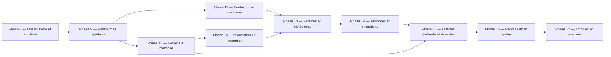

# Roadmap d’émergence de Chartographist

Ce document transforme l’analyse approfondie du projet en plan d’implémentation. Il prolonge les phases 0 à 7 déjà réalisées et devient la feuille de route des phases 8 à 17.

Les règles de [`AGENTS.md`](AGENTS.md) restent impératives : prévention des régressions, TDD strict test-first, déterminisme via `RandomService`, i18n fr/en/es et mise à jour de [`REFERENTIEL_PROJET.md`](REFERENTIEL_PROJET.md) après toute évolution structurante.

## Vision

Le but n’est pas d’accumuler des événements scriptés. Le but est d’obtenir des histoires que le moteur n’a pas écrites explicitement : famines causées par un sol épuisé, migrations qui déplacent une religion, routes commerciales devenues enjeux militaires, lignées qui accèdent au pouvoir, ruines dont les objets racontent une crise ancienne.

Une fonctionnalité contribue à l’émergence si elle relie plusieurs systèmes par une boucle causale persistante :

```text
état du monde → perception imparfaite → décision → coût/transfert
               → conséquence locale → mémoire/histoire → nouvelle décision
```

Chaque nouvelle règle doit répondre à quatre questions :

1. Quelle quantité, information ou relation est conservée ?
2. Qui peut la percevoir, et avec quelle incertitude ?
3. Quelles décisions différentes peut-elle provoquer ?
4. Quelle trace durable permet d’expliquer le résultat ?

## Principes architecturaux transversaux

### Compatibilité

- Chaque nouveau système est activé par une section de configuration explicite.
- Un ancien template sans cette section conserve le comportement historique.
- Les anciennes sauvegardes sont migrées paresseusement avec des valeurs neutres.
- Les contrats publics de `world`, `stats` et `SimulationEngine` ne sont retirés qu’après une migration documentée.

### TDD et validation

Pour chaque lot fonctionnel :

1. écrire un test de caractérisation du comportement historique concerné ;
2. écrire le test rouge du nouveau contrat ;
3. observer l’échec pour la raison attendue ;
4. implémenter le changement minimal ;
5. exécuter les tests ciblés ;
6. exécuter la suite complète ;
7. lancer des simulations multi-graines et contrôler les invariants ;
8. mettre à jour les trois locales et la documentation.

### Déterminisme

- Tous les tirages passent par [`core/random_service.py`](core/random_service.py).
- Les agrégations dont l’ordre influence une décision sont triées par identifiant stable.
- Les simulations interrompues/reprises doivent rester identiques aux simulations continues.
- Les outils d’analyse ne doivent pas consommer le PRNG de la simulation.

### Échelle de simulation

Le projet doit rester hiérarchique :

- les colonies et cohortes portent les calculs de masse ;
- les personnages importants conservent une simulation individuelle complète ;
- un individu ordinaire peut être promu en personnage notable lorsqu’un événement le rend historiquement pertinent ;
- les recherches spatiales utilisent des index, jamais un scan global lorsque la population augmente.

### Définition de « terminé » pour une phase

Une phase est terminée lorsque :

- les contrats headless sont accessibles sans rendu terminal ;
- les nouveaux états sont sérialisables et migrent depuis un monde ancien ;
- les textes visibles existent dans les trois locales avec parité de placeholders ;
- les tests couvrent nominal, limites, contrats inter-modules et reprise déterministe ;
- au moins 20 graines courtes et 3 graines longues respectent les invariants de la phase ;
- une comparaison avant/après mesure l’effet réel du système ;
- `REFERENTIEL_PROJET.md` décrit les nouveaux propriétaires et flux.

## Dépendances des phases



---

# Phase 8 — Observatoire et équilibrage systémique

> État : terminée le 23 août 2026. Validation : 182 tests, campagne courte 3 × 120 cycles et campagne longue 3 × 1 200 cycles sans extinction.

## Intention d’émergence

Rendre visibles les boucles actives, dormantes ou dominantes avant de modifier l’équilibre. Cette phase doit empêcher qu’un système apparemment riche reste sans effet réel pendant des milliers de cycles.

## Problèmes actuels ciblés

- Le placement initial peut créer zéro civilisation.
- La nourriture reste souvent au plafond.
- La trésorerie et la diplomatie évoluent peu.
- La reproduction animale peut dépasser `max_fauna`.
- Les tests valident surtout des unités, moins les distributions sur plusieurs graines.

## Nouveaux contrats proposés

- `world['metrics']` : compteurs sérialisables de flux et d’états.
- `SimulationEngine.get_metrics_snapshot()` : copie défensive.
- `SimulationEngine.run_observed(cycles, sample_every)` : séries temporelles sans consommation du PRNG.
- Un outil batch séparé produit JSON/CSV de comparaison entre graines.
- Des codes explicites décrivent un échec d’initialisation du monde.

## Plan d’implémentation

### Lot 8.1 — Caractérisation et observatoire

1. Ajouter `tests/test_simulation_metrics.py`.
2. Caractériser production/consommation alimentaire, population, colonies, faune, trésorerie, prix, transactions, statuts diplomatiques, naissances et décès.
3. Créer `core/simulation_metrics.py` avec des compteurs de flux qui n’altèrent aucun système.
4. Brancher les producteurs existants : travail, alimentation, naissance, mort, commerce, raid, chasse, événement climatique.
5. Exposer des snapshots défensifs et des séries temporelles.

### Lot 8.2 — Banc multi-graines

1. Créer un runner headless sous `tools/` ou `scripts/`.
2. Séparer métriques de simulation et présentation du rapport.
3. Ajouter des profils : 120 cycles, 1 200 cycles, reprise à mi-parcours.
4. Calculer médiane, dispersion, taux d’extinction, diversité culturelle et fréquence d’utilisation des systèmes.
5. Ajouter un test garantissant que l’observation ne modifie pas l’état du PRNG.

### Lot 8.3 — Amorçage garanti

1. Écrire un test rouge sur un corpus fixe de graines problématiques.
2. Séparer recherche de sites habitables et instanciation des cités.
3. Classer les tuiles candidates par habitabilité au lieu de limiter le démarrage à 100 tirages aveugles.
4. Préserver le placement historique lorsque celui-ci réussit ; utiliser le classement comme repli déterministe.
5. Enregistrer une chronique système si le nombre demandé de cités ne peut réellement pas être placé.

### Lot 8.4 — Budget démographique de la faune

1. Distinguer capacité mondiale, capacité par biome et capacité par espèce.
2. Inclure naissances et apparitions dans le même budget.
3. Empêcher la reproduction lorsque l’habitat ne peut plus nourrir un nouvel individu.
4. Préserver le comportement historique quand `ecology.population_limits.enabled` est absent.
5. Tester absence de croissance exponentielle et reprise déterministe.

### Lot 8.5 — Rééquilibrage alimentaire minimal

1. Mesurer séparément nourriture créée, consommée, importée, pillée et perdue.
2. Retirer l’autosuffisance implicite du travail générique uniquement dans le nouveau mode d’équilibre.
3. Introduire coûts de conservation et pertes bornées.
4. Faire dépendre la spécialisation de ratios et tendances, pas seulement d’un seuil instantané.
5. Calibrer sur des distributions, sans imposer qu’une graine particulière survive.

## Fichiers principaux

- [`core/simulation_engine.py`](core/simulation_engine.py)
- [`core/world_factory.py`](core/world_factory.py)
- [`entities/spawn_system.py`](entities/spawn_system.py)
- [`entities/constructs/city.py`](entities/constructs/city.py)
- [`entities/constructs/village.py`](entities/constructs/village.py)
- [`entities/species/animal/base.py`](entities/species/animal/base.py)
- [`core/economy.py`](core/economy.py)
- [`core/persistence.py`](core/persistence.py)

## Critères de sortie

- Le nombre de cités initiales est déterministe et explicable sur le corpus de graines.
- La faune respecte une capacité documentée, reproduction comprise.
- Les flux alimentaires se réconcilient dans les métriques.
- Le banc multi-graines détecte extinction, saturation et systèmes jamais activés.
- Une observation activée ou non produit exactement le même monde.

---

# Phase 9 — Ressources spatiales et écologie renouvelable

> État : terminée en mode opt-in le 24 août 2026. Le cycle de vie faunique actif utilise un flux `ecology` isolé et persisté ; le mode historique conserve le flux par défaut. Validation commune aux phases 9–11 : 284 tests, 98 tests dédiés et 3 × 1 200 cycles combinés sans extinction. `resources.enabled` reste à `false` pour préserver le mode standard.

## Intention d’émergence

Transformer le terrain en acteur causal. Une tuile doit pouvoir être fertile, surexploitée, incendiée, recolonisée ou rendue stratégique par ce qu’elle contient.

## Modèle proposé

`world['resources']` contient des grilles NumPy ou structures compactes :

- `biomass` ;
- `soil_fertility` ;
- `surface_water` ;
- `fish_stock` ;
- `forest_cover` ;
- ultérieurement `stone` et `ore`.

Chaque valeur possède capacité, stock courant et taux de régénération.

## Plan d’implémentation

### Lot 9.1 — Service de ressources headless

1. Écrire les tests de forme, bornes, déterminisme et migration.
2. Créer `core/resources.py` et `ResourceSystem`.
3. Générer les capacités depuis relief, rivières, climat et biome.
4. Initialiser explicitement le stockage dans `world_factory`.
5. Exposer `get_tile_resources(x, y)` et un résumé mondial.

### Lot 9.2 — Régénération

1. Définir une cadence saisonnière.
2. Faire dépendre la régénération de température, humidité et fertilité.
3. Ajouter mortalité hivernale, sécheresse et récupération après crise.
4. Borner chaque stock et garantir l’absence de valeurs non finies.

### Lot 9.3 — Consommation écologique

1. Faire consommer de la biomasse aux herbivores.
2. Faire dépendre leur énergie du prélèvement réellement obtenu.
3. Lier reproduction animale à énergie, habitat et capacité locale.
4. Faire diminuer les populations lorsque la nourriture manque.
5. Ajouter migration animale vers des habitats voisins plus favorables.

### Lot 9.4 — Agriculture et pêche

1. Les fermiers prélèvent un rendement produit par fertilité, eau, saison et travail.
2. Les récoltes réduisent temporairement la fertilité ; repos et crues peuvent la restaurer.
3. Les pêcheurs prélèvent `fish_stock`, qui se régénère selon habitat et saison.
4. Ajouter surexploitation et effondrement local des stocks.
5. Conserver les anciennes formules lorsque le système est désactivé.

### Lot 9.5 — Perturbations persistantes

1. Les volcans brûlent biomasse et forêt et modifient localement le sol.
2. Les crues déplacent eau/fertilité au lieu d’être une simple anomalie globale.
3. Les incendies se propagent selon végétation et humidité.
4. Les terres abandonnées se réensauvagent progressivement.

## Tests structurants

- Conservation des prélèvements : gain d’un consommateur ≤ ressource retirée.
- Régénération bornée par la capacité.
- Surpâturage → baisse de biomasse → baisse d’énergie → baisse de population.
- Deux biomes produisent des trajectoires écologiques différentes.
- Reprise de checkpoint identique au cycle près.

## Critères de sortie

- La nourriture ne peut plus être créée sans source spatiale dans le mode actif.
- Une sécheresse peut provoquer une chaîne mesurable jusqu’à la population.
- Une région surexploitée récupère ou change durablement d’usage.
- Prédateurs et proies forment des cycles plutôt qu’une croissance illimitée.

---

# Phase 10 — Besoins, compétences, mémoire et personnages notables

> État : terminée en mode opt-in le 24 août 2026. Les citoyens ordinaires utilisent une cadence de cohorte configurable, les notables gardent la cadence fine et les états courants évitent une migration coûteuse. Validation commune aux phases 9–11 : 284 tests, 98 tests dédiés et 3 × 1 200 cycles combinés sans extinction. `characters.enabled` reste à `false` pour préserver le mode standard.

## Intention d’émergence

Faire décider les agents depuis leur situation personnelle plutôt que depuis leur classe seule, tout en maintenant une échelle de calcul viable.

## Modèle proposé

Un personnage notable possède :

- besoins : faim, sécurité, appartenance, statut, foi, richesse ;
- compétences : agriculture, chasse, commerce, combat, soin, commandement ;
- traits : prudence, ambition, empathie, avidité, ferveur ;
- relations personnelles : affection, confiance, dette, peur, grief ;
- mémoire bornée d’événements vécus ou appris.

## Plan d’implémentation

### Lot 10.1 — Cohortes et notabilité

1. Mesurer le coût actuel des citoyens individuels.
2. Introduire un contrat `PopulationCohort` pour les habitants ordinaires sans supprimer immédiatement les citoyens existants.
3. Définir les événements de promotion en notable : accession à un rôle, victoire, découverte, crime, mariage politique, survie à une catastrophe.
4. Garantir un `entity_id` stable lors de la promotion.
5. Archiver les notables morts ou redevenus secondaires sans perdre leur histoire.

### Lot 10.2 — Besoins et compétences

1. Créer `core/needs.py` et `core/skills.py` avec valeurs bornées.
2. Ajouter évolution mensuelle et effets des actions.
3. Faire progresser les compétences par pratique, avec rendements décroissants.
4. Migrer progressivement Farmer/Hunter/Trader/Soldier vers des rôles basés sur compétences.

### Lot 10.3 — Décision par utilité

1. Définir des actions candidates avec préconditions, coût, risque et satisfaction attendue.
2. Calculer un score déterministe, le bruit éventuel passant par `RandomService`.
3. Exposer en inspection les trois meilleures options et la raison du choix.
4. Conserver les IA historiques derrière un adaptateur lorsque le système est désactivé.

### Lot 10.4 — Mémoire personnelle

1. Créer des faits structurés : témoin, cible, lieu, cycle, intensité, fiabilité.
2. Ajouter oubli, renforcement et généralisation en opinion.
3. Relier raids, famines, sauvetages, commerces et conversions aux mémoires.
4. Déduire confiance, peur et grief depuis ces faits plutôt que par mutation opaque.

### Lot 10.5 — Familles et héritage

1. Étendre les liens familiaux aux ménages.
2. Transmettre nom, patrimoine, foi, réputation et certains traits.
3. Ajouter deuil, rivalité successorale et solidarité familiale.
4. Générer les chroniques depuis les conséquences significatives, pas chaque micro-action.

## Contraintes de performance

- Mémoire bornée et indexée par importance.
- Pas de comparaison de chaque individu avec toute la population.
- Relations détaillées uniquement entre notables ou membres d’un même ménage.
- Décisions coûteuses distribuées sur plusieurs cadences.

## Critères de sortie

- Deux agents de même métier peuvent agir différemment dans la même situation.
- Une expérience passée modifie une décision future de manière inspectable.
- Un personnage peut devenir notable par ce qui lui arrive.
- Les populations importantes restent simulables grâce aux cohortes.

## Résultat du socle livré

- `core/characters.py` possède l’état personnel versionné, les décisions par utilité, les cohortes et le cycle de vie des notables ; `core/needs.py`, `core/skills.py` et `core/memory.py` isolent les règles bornées.
- Les choix expliquent leurs trois meilleurs scores, n’utilisent aucun hasard implicite et sont distribués sur trois cadences selon l’`entity_id`.
- Le commerce et les raids alimentent des mémoires vécues ; peur et grief issus d’un raid peuvent modifier une décision future.
- Les promotions de métier conservent identité, famille, compétences et souvenirs. Les enfants héritent de traits moyens et d’une part bornée des compétences parentales.
- `world['notables']` et `world['notable_archive']` sont sérialisables ; l’archive est idempotente et conserve un instantané défensif complet.
- Inspection, cohortes et métriques exposent décisions, repos, promotions, archives et état courant sans consommer le PRNG.
- À cadence de cohorte 6, les trois graines longues survivent et le coût baisse d’environ 31–33 % après optimisation des états déjà migrés.
- Les producteurs de mémoire pour sauvetages, conversions et catastrophes restent à brancher lors des phases information/institutions ; le schéma les accepte déjà sans nouveau format.

---

# Phase 11 — Production, inventaires, métiers et marchés

> État : terminée en mode opt-in le 24 août 2026. Durabilité, qualité, sous-produits, spécialisation, coûts/pertes de transport, cinq infrastructures, entretien, dommages et réparation concurrente sont opérationnels. Validation commune aux phases 9–11 : 284 tests, 98 tests dédiés et 3 × 1 200 cycles combinés sans extinction. `materials.enabled` reste à `false` pour préserver le mode standard.


## Intention d’émergence

Faire naître les métiers, échanges et crises depuis des chaînes de production et besoins matériels réels.

## Modèle proposé

- Définitions data-driven de ressources et objets.
- Inventaires personnels légers et stockages de colonies.
- Recettes avec entrées, outils, compétence, temps et sorties.
- Ordres de travail issus des pénuries et priorités collectives.
- Prix formés par stock, demande récente, coût et accessibilité.

## Plan d’implémentation

### Lot 11.1 — Catalogue matériel

1. Définir les schémas `resources`, `items` et `recipes` dans le template/modding.
2. Valider IDs, références, cycles et quantités positives.
3. Créer `core/materials.py` et des snapshots immuables.
4. Ajouter tests de mods qui étendent matériaux et recettes sans conflit.

### Lot 11.2 — Stockages et conservation

1. Ajouter `stockpile` aux colonies avec migration vide.
2. Centraliser tous les transferts dans un service transactionnel.
3. Interdire stocks négatifs et duplication d’objets.
4. Ajouter capacité, détérioration et pertes selon le type de bien.

### Lot 11.3 — Production

1. Construire des ordres depuis besoins alimentaires, construction, défense et commerce.
2. Affecter la main-d’œuvre selon compétences, urgence et préférences.
3. Consommer ressources, temps et outils avant de produire.
4. Gérer échec partiel, qualité et sous-produits.

### Lot 11.4 — Marchés multi-biens

1. Généraliser `TradeTransaction` à plusieurs marchandises.
2. Faire choisir les routes selon prix, risque, distance et capacité.
3. Ajouter coût de transport, péages et pertes.
4. Laisser apparaître arbitrage, pénuries régionales et spécialisations.
5. Maintenir la conservation exacte des biens et de la monnaie.

### Lot 11.5 — Infrastructures

1. Routes, greniers, marchés, ateliers et fortifications deviennent des constructions avec coût et entretien.
2. Leur état modifie transport, pertes, défense et capacité.
3. Les catastrophes peuvent les endommager ; la réparation concurrence les autres ordres.

## Critères de sortie

- Une ville ne produit pas sans ressources, travail et outils requis.
- Une pénurie crée une chaîne de décisions observable.
- Des régions différentes développent des spécialisations différentes.
- Les prix influencent réellement les routes commerciales.

## État d’implémentation du socle

- Le catalogue, les stockages conservateurs, la détérioration, les ordres déterministes et leur persistance sont opérationnels.
- La chaîne nourriture brute → travail outillé → ration → consommation fonctionne réellement et reste compatible avec le stock alimentaire historique.
- Les transactions multi-biens conservent monnaie et marchandises ; les prix, la distance et le risque influencent le classement déterministe des marchés.
- Un ordre irréalisable ne bloque plus les recettes réalisables, ce qui protège la production alimentaire d’une famine de file.
- Le bois est prélevé de manière conservatrice dans la forêt locale, sous plancher écologique, puis transformé en planches par un travailleur compétent.
- Les outils s’usent et sont remplacés ; qualité, sous-produits, totaux et spécialisation sont persistés. Grenier, route, marché, atelier et fortification appliquent leurs effets selon leur niveau et condition.
- Inspection et métriques rendent visibles stocks, capacités, ordres, production, pertes et échanges.
- Entretien et réparation consomment des matériaux ; les aléas endommagent les infrastructures. Coûts et pertes modifient les routes tout en réconciliant monnaie, biens livrés et perdus.
- Les quatre critères de sortie sont couverts. Sur 24 × 12 × 1 200, les graines 11/29/47 finissent à 28/31/11 habitants, 1/2/1 établissements et 20/20/5 animaux : aucune extinction.


---

# Phase 12 — Information locale, exploration et rumeurs

> État : terminée en mode opt-in le 24 août 2026. Validation : 19 contrats dédiés, 303 tests complets et 3 × 1 200 cycles avec les phases 9–12 actives sans extinction. `knowledge.enabled` reste à `false` pour préserver le mode historique.

## Intention d’émergence

Supprimer l’omniscience. Faire de l’information une ressource qui voyage, vieillit, se déforme et influence les décisions.

## Plan d’implémentation

### Lot 12.1 — Graphe de connaissances

1. Créer `core/knowledge.py`.
2. Stocker pour chaque colonie/notable des faits avec source, cycle, fiabilité et position estimée.
3. Migrer `known_cities` vers des connaissances structurées.
4. Remplacer les appels globaux de `DiscoveryService` dans le nouveau mode.

### Lot 12.2 — Observation et cartographie

1. Ajouter rayon de perception et découvertes de terrain/sites/ressources.
2. Les explorateurs construisent des cartes partielles.
3. Les cartes peuvent être copiées, vendues, volées ou devenir obsolètes.
4. L’inspection distingue fait mondial et connaissance de l’agent.

### Lot 12.3 — Propagation des nouvelles

1. Commerce, migration, armées et pèlerinages transportent des faits.
2. La fiabilité diminue avec nombre de transmissions, distance et temps.
3. Traits et relations influencent croyance et déformation.
4. Une correction peut concurrencer une ancienne rumeur.

### Lot 12.4 — Décisions sous information imparfaite

1. Les marchands évaluuent marchés connus, pas prix mondiaux exacts.
2. Les villes réagissent aux menaces rapportées.
3. Les migrants choisissent depuis réputation et rumeurs.
4. Les erreurs d’information peuvent créer expéditions inutiles ou conflits.

## Critères de sortie

- Une colonie isolée ignore réellement une ville distante.
- Une route commerciale accélère aussi la diffusion d’informations et religions.
- Deux communautés peuvent croire des versions différentes d’un même événement.
- Toute décision basée sur une rumeur expose sa source et sa fiabilité.

---

# Phase 13 — Factions, institutions et politique

> État : terminée en mode opt-in le 24 août 2026. Validation : 22 contrats dédiés, 330 tests complets et 3 × 240 cycles headless. L’historique conserve au plus 256 conflits par établissement et chaque type de faction au plus 32 groupes ; `politics.enabled` reste à `false` pour préserver le mode historique.

## Intention d’émergence

Faire de la colonie un ensemble d’intérêts concurrents, pas un acteur homogène.

## Modèle proposé

- factions : familles, métiers, religions, militaires, marchands ;
- institutions : conseil, chefferie, monarchie, temple, guildes ;
- offices détenus par des notables ;
- légitimité, influence, ressources et revendications ;
- politiques qui modifient réellement taxes, travail, commerce, religion et guerre.

## Plan d’implémentation

### Lot 13.1 — Registre de factions

1. Créer `core/factions.py` avec IDs stables et stockage dans `world` ou la colonie.
2. Déduire l’adhésion depuis ménage, métier, foi et relations.
3. Ajouter influence, satisfaction et objectifs bornés.
4. Exposer inspection et chroniques liées.

### Lot 13.2 — Institutions et offices

1. Définir les formes de gouvernement data-driven.
2. Créer offices, règles d’éligibilité, durée et succession.
3. Nommer des notables sans créer de doublon d’identité.
4. Ajouter vacance, régence et crise successorale.

### Lot 13.3 — Décisions collectives

1. Les politiques deviennent des propositions avec partisans/opposants.
2. Calculer soutien depuis intérêts, relations, légitimité et information.
3. Appliquer les politiques via des modificateurs explicites et temporisés.
4. Journaliser causes, vote/décision et groupes affectés.

### Lot 13.4 — Conflits internes

1. Accumuler mécontentement par faim, pertes, discrimination, taxes et défaites.
2. Produire protestation, sabotage, sécession ou révolte selon capacités réelles.
3. Permettre négociation, répression et réforme.
4. Relier guerre civile à territoire et migrations de la phase suivante.

## Critères de sortie

- Deux factions d’une même ville poursuivent des objectifs incompatibles.
- Une succession dépend des personnes et règles existantes.
- Une famine peut provoquer réforme, coup d’État ou exode selon le contexte.
- Les politiques ont des gagnants, perdants et conséquences mesurables.

---

# Phase 14 — Territoires, logistique, migrations et guerre causale

> État : terminée en mode opt-in le 24 août 2026. Validation : 36 contrats dédiés, 366 tests complets et 3 × 120 cycles avec territoire, chemins, migrations, guerre et paix actifs. Le profil mesuré passe de 0,1041 s à 0,1902 s en moyenne sur 120 cycles (carte 20 × 12), sans erreur d’entité ; les cinq sections restent désactivées par défaut.

## Intention d’émergence

Donner une géographie réelle au pouvoir. Une guerre doit découler d’enjeux et dépendre de routes, ravitaillement, saison, information et soutien politique.

## Plan d’implémentation

### Lot 14.1 — Revendications territoriales

1. Créer une couche de contrôle/influence par colonie ou polity.
2. Propager l’influence selon population, routes, fortifications et distance.
3. Détecter frontières et tuiles contestées.
4. Relier ressources stratégiques et griefs diplomatiques.

### Lot 14.2 — Mobilité et chemins

1. Remplacer le déplacement purement glouton par un service de chemin configurable.
2. Intégrer terrain, route, météo, danger et connaissance.
3. Mettre en cache les routes avec invalidation lorsque le monde change.
4. Mesurer le coût pour éviter une explosion algorithmique.

### Lot 14.3 — Migration

1. Calculer pressions de départ : faim, guerre, climat, persécution, opportunité.
2. Calculer attractivité depuis informations connues, liens familiaux et capacité d’accueil.
3. Déplacer cohortes et quelques notables plutôt que tous les individus séparément.
4. Transporter foi, culture, compétences, maladies et récits.
5. Ajouter intégration, diaspora, discrimination et retours.

### Lot 14.4 — Guerre et logistique

1. Remplacer la probabilité brute par des objectifs de guerre : ressource, frontière, vengeance, religion, succession.
2. Créer armées/cohortes avec vivres, moral et commandement.
3. Le ravitaillement dépend des routes, stocks, saisons et raids.
4. Les pertes affectent familles, factions, économie et légitimité.
5. Ajouter occupation, siège, retraite, prisonniers et traité.

### Lot 14.5 — Paix et conséquences

1. Les traités transfèrent territoire, tribut, otages ou droits commerciaux.
2. Les griefs diminuent ou persistent selon le règlement.
3. Ruines, vétérans, réfugiés et dettes continuent d’influencer le monde.
4. La diplomatie résume ces causes sans perdre son adaptateur historique.

## Critères de sortie

- Une guerre possède une cause, un objectif, un coût et une fin explicables.
- Une armée isolée peut échouer malgré sa supériorité numérique.
- Une migration modifie durablement culture, économie et politique des régions traversées.
- Les frontières répondent aux routes, populations et ressources.

---

# Phase 15 — Histoire profonde, objets, sites et légendes

## Intention d’émergence

Rendre les chaînes causales lisibles et mémorables. L’histoire ne doit pas seulement être un journal de chaînes, mais un graphe de faits, acteurs, objets, lieux et conséquences.
> État du lot 15.1 : terminé en mode opt-in le 24 août 2026. Les chroniques v2 forment un graphe borné et rétrocompatible ; guerre, paix et migration produisent des faits structurés visibles dans les onglets `[H]` et `[Y]`.

> État du lot 15.2 : terminé en mode opt-in le 24 août 2026. Les sites disposent d’identités stables, d’un cycle de vie borné, de chroniques structurées, d’une apparence évolutive et d’une visibilité carte/headless/[Y] ; batailles, ruines et recolonisation alimentent réellement le registre.

> État du lot 15.3 : terminé en mode opt-in le 25 août 2026. Les objets produits peuvent devenir des artefacts matériels conservés, dotés d’une provenance bornée et de transferts explicites ; leur renommée agit sur prestige, revendications et attractivité de pèlerinage, avec visibilité headless/[H]/[Y].

> État du lot 15.4 : terminé en mode opt-in le 25 août 2026. Les faits restent distincts des versions publiques culturelles ou partisanes ; propagation, renommée et motivations sont bornées, déterministes, persistantes et visibles dans l'API headless et l'onglet `[Y]`.

> État du lot 15.5 : terminé en mode opt-in le 25 août 2026. Le service « Pourquoi ? » interroge entités, lieux, objets, familles et événements, construit vues chronologiques et causales, explique faim, guerres, sites et artefacts, puis expose filtres terminal `[W]` et export JSON.

> **Phase 15 terminée le 25 août 2026.** Validation : 411 tests complets et benchmark 3 × 120 cycles sur 60 × 30 avec toutes les options actives en 1,33 à 1,77 s par graine ; 41 à 58 artefacts et 40 à 58 versions de légendes ont émergé sans erreur.


## Plan d’implémentation

### Lot 15.1 — Événements causaux structurés

1. Étendre les chroniques avec `event_type`, acteurs, objets, lieux, causes et conséquences.
2. Conserver `message` pour compatibilité terminal et sauvegardes existantes.
3. Introduire des liens `caused_by` et `resulted_in` bornés.
4. Produire le texte par i18n depuis les faits structurés lorsque possible.

### Lot 15.2 — Sites persistants

1. Donner une identité aux champs de bataille, ruines, sanctuaires, mines et routes remarquables.
2. Stocker fondation, propriétaires, destructions et reconstructions.
3. Faire évoluer l’apparence et les ressources selon l’histoire du site.
4. Permettre redécouverte et réoccupation.

### Lot 15.3 — Objets et artefacts

1. Promouvoir certains objets en artefacts selon qualité, propriétaire et événements vécus.
2. Conserver créateur, matériau, inscriptions, détenteurs et lieux.
3. Faire circuler les artefacts par héritage, commerce, pillage, don et perte.
4. Leur réputation influence prestige, revendications et pèlerinages.

### Lot 15.4 — Réputation et légendes

1. Distinguer faits réels, connaissances et récits publics.
2. Calculer renommée depuis propagation et importance, pas depuis un score arbitraire isolé.
3. Faire varier les versions d’une légende selon culture et faction.
4. Permettre qu’une légende motive exploration, guerre ou culte.

### Lot 15.5 — Interface « Pourquoi ? »

1. Ajouter requêtes headless par entité, lieu, objet, famille et événement.
2. Construire une vue chronologique et une vue causale.
3. Pour une situation actuelle, exposer les principales causes : « pourquoi cette ville a faim ? », « pourquoi cette guerre ? ».
4. Ajouter filtres terminal et exports structurés pour outils futurs.

## Critères de sortie

- Une situation importante peut être expliquée par une chaîne causale traversant plusieurs systèmes.
- Les ruines et artefacts conservent leur histoire après disparition de leurs créateurs.
- Deux cultures peuvent raconter différemment le même fait.
- Le joueur peut découvrir une histoire sans que celle-ci ait été écrite comme scénario prédéfini.

---

# Phase 16 — Rendu web, navigation navigateur et spritesheets

## Intention

Ajouter un mode navigateur local et une couche par sprites sans déplacer la
simulation hors de Python ni modifier le terminal historique. L'étude complète
est dans [`ETUDE_PHASE_16_RENDU_WEB.md`](ETUDE_PHASE_16_RENDU_WEB.md).

> **Phase 16 terminée le 26 août 2026.** Les lots 16.0 à 16.7 sont
> implémentés et validés par 446 tests.
> Le mode terminal reste le défaut sans dépendance web ; le mode optionnel sert
> désormais une carte Canvas navigable, les panneaux, la sélection, les contrôles
> et les deltas WebSocket exclusivement sur une adresse de bouclage. La projection
> est différée sans client et l'application des deltas côté navigateur est en O(k)
> sur le nombre de cellules modifiées.

## Lots

### Lot 16.0 — Caractérisation, budgets et décision d'architecture
Figer la priorité visuelle, mesurer les budgets et valider protocole et dépendance.

### Lot 16.1 — Projection sémantique
Créer snapshots JSON, clés de rendu stables et résolveur commun des cellules.

### Lot 16.2 — Hôte de simulation
Extraire cadence, pause, pas-à-pas et arrêt en préservant le terminal par défaut.

### Lot 16.3 — Serveur et protocole web local
Terminé : lectures headless, flux versionné, limites de requête, origines locales,
commandes bornées et dépendance `aiohttp` optionnelle.

### Lot 16.4 — Navigation navigateur
Terminé : carte Canvas à rendu borné au viewport, zoom, déplacement, sélection,
contrôles de cadence, reconnexion, journaux, panneaux, clavier, responsive et
libellés fr/en/es.

### Lot 16.5 — Spritesheets data-driven
Terminé : catalogue de 42 clés standard, manifeste v1 validé, atlas classique
8 × 8 licencié, routes filtrées, fallback progressif et thème Canvas par
couches interchangeable à chaud avec les glyphes. Un second atlas Interwoven
8 × 8 ajoute des sprites carrés et un mélange interlacé optionnel des frontières
de terrains, sans modifier le thème classique.

### Lots 16.6–16.7 — Optimisation et stabilisation
Terminé : projection différée tant qu'aucun client n'est connecté, index de
cellules réutilisé pour appliquer les deltas sans recopier la carte, reprise par
delta après reconnexion et contrats de révision couverts. Validation complète :
446 tests, routes HTTP et commandes réelles sur `127.0.0.1`, puis trois campagnes
60 × 30 × 1 200 cycles (graines 1661, 1667 et 1673) sans extinction.

## Critères de sortie

- Sans nouvelle option, le mode terminal est inchangé.
- Le navigateur n'accède directement ni à `world`, ni au pickle, ni au PRNG.
- Glyphes et sprites partagent les mêmes clés et priorités.
- Le profil 60 × 30 reste fluide sur matériel modeste.
- Déconnexion et fermeture ne corrompent jamais le moteur.

---

# Ordre de réalisation recommandé à l’intérieur de chaque phase

Pour réduire le risque, chaque phase suit le même découpage :

1. **Contrats et caractérisation** — tests du comportement actuel et schéma des nouveaux états.
2. **Service headless pur** — calculs sans terminal ni mutation externe implicite.
3. **Intégration minimale** — un producteur et un consommateur réels.
4. **Persistance et migration** — checkpoint courant et monde ancien.
5. **Inspection et métriques** — expliquer l’état avant d’étendre les effets.
6. **Extension data-driven** — template, scénario et mods.
7. **Interface et i18n** — textes fr/en/es et navigation.
8. **Validation émergente** — tests multi-graines, simulations longues et comparaison statistique.

# Phase 17 — Archives portables, chronologie et relecture

## Intention

Permettre à l'utilisateur de revoir et partager l'histoire d'un monde sans
exposer le checkpoint Python et sans transformer la consultation en mutation de
la simulation. L'étude complète est dans
[`ETUDE_PHASE_17_ARCHIVES_RELECTURE.md`](ETUDE_PHASE_17_ARCHIVES_RELECTURE.md).

> État au 26 août 2026 : lots 17.0 à 17.2 terminés. Le format portable v1 et
> l'enregistreur borné sont implémentés ; aucune option CLI ne les active encore.

## Lots

### Lot 17.0 — Caractérisation et ADR
Terminé : le profil 60 × 30 × 1 200 retient une image clé tous les 60 cycles,
une archive estimée à 7,069 Mio et une reconstruction exacte de 59 deltas en
42,935 ms médianes (50,123 ms au 95e percentile).

### Lot 17.1 — Format et validation
Terminé : manifeste v1 canonique, membres JSON/NDJSON bornés, empreintes SHA-256,
écriture temporaire synchronisée puis remplacée atomiquement, et rejets
structurés des archives dangereuses, surdimensionnées ou incohérentes.

### Lot 17.2 — Enregistreur borné
Terminé : staging disque, mémoire limitée à un segment, image clé tous les 60
cycles, finalisation atomique normale ou sur `Ctrl+C`, abandon sur erreur et
consommateur optionnel de snapshots. Un smoke test 60 × 30 × 120 reproduit
exactement l'état sans enregistrement et produit une archive de 0,745 Mio.

### Lot 17.3 — Lecture headless
Reconstruire une révision et comparer deux dates sans PRNG ni état global.

### Lot 17.4 — API locale de consultation
Servir une archive choisie au lancement, en lecture seule et sur boucle locale.

### Lot 17.5 — Frise navigateur
Naviguer dans le temps, rejoindre les faits marquants et visualiser les écarts.

### Lot 17.6 — CLI, i18n et documentation
Ajouter les options opt-in, les libellés fr/en/es et le parcours utilisateur.

### Lot 17.7 — Performance et stabilisation
Valider sécurité, déterminisme, campagnes longues et absence de régression.

## Critères de sortie

- Une histoire de 1 200 cycles est consultable et partageable sans `pickle`.
- Une archive ne peut jamais muter ou reprendre directement la simulation.
- L'enregistrement désactivé ne pénalise pas les modes existants.
- Le lecteur refuse les archives hors limites avant reconstruction.
- Le navigateur distingue sans ambiguïté direct et archive.
- Terminal, web direct, sprites et checkpoints historiques restent compatibles.

---

# Prochaine étape : lot 17.3 — lecture headless

Le prochain incrément reconstruira une révision ou un cycle depuis l'image clé
précédente, sans PRNG ni mutation globale, puis exposera une comparaison
structurée entre deux dates.
